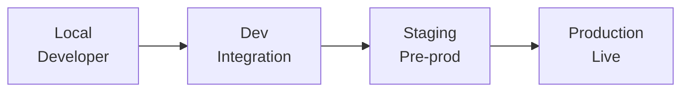
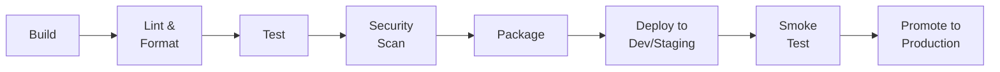
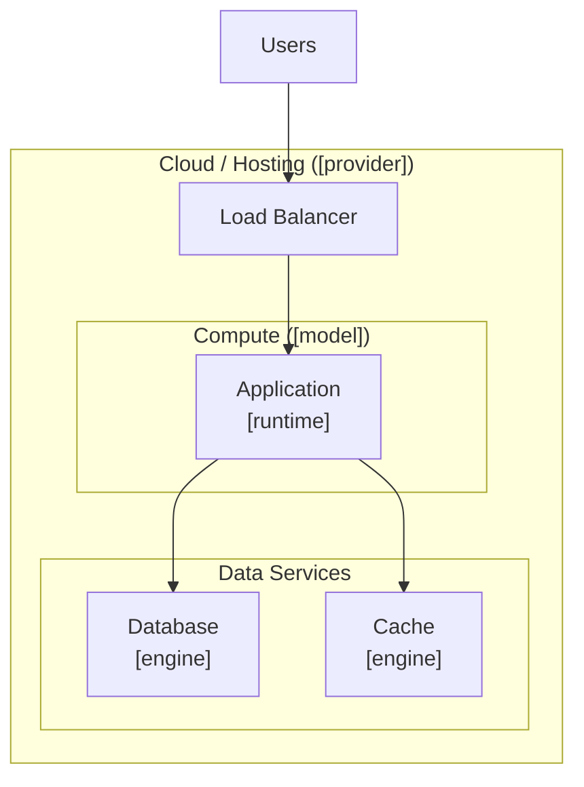

# Deployment & Operations Document: [PROJECT]

> Date: [DATE] | Status: Draft

## Deployment Summary and Context

[Deployment goals, operational priorities, relation to architecture.]

## Environment Strategy

| Environment | Purpose | Promotion Gate | Data Strategy | Parity with Prod |
|-------------|---------|---------------|---------------|------------------|
| Local | [Developer workstation] | [None] | [Seed/fixtures] | [Minimal] |
| Dev | [Integration testing] | [CI pass] | [Synthetic] | [Partial] |
| Staging | [Pre-production validation] | [QA sign-off] | [Anonymized prod subset] | [High] |
| Production | [Live traffic] | [Release approval] | [Real] | [Baseline] |

### Environment Flow

### Feature Flags and Progressive Rollout

- **Feature flags**: [e.g. LaunchDarkly, Unleash, custom process, or none]
- **Rollout strategy**: [e.g. canary -> percentage ramp -> full, blue-green, A/B]
- **Rollback trigger**: [e.g. failed health checks, error-budget burn, manual rollback]

## Deployment Targets and Packaging

- **Deployment model**: [e.g. container images, serverless functions, static site, mobile bundles, hybrid]
- **Build artifact**: [e.g. Docker image, binary, zip bundle, .ipa/.aab]
- **Container registry**: [e.g. GHCR, ACR, ECR, GCR, or N/A]
- **Image tagging**: [git SHA/semver/immutable tags]
- **Vulnerability scanning**: [tool/process]
- **App store distribution**: [channel or N/A]
- **Edge/CDN**: [service or N/A]

## CI/CD Pipeline Design

### Pipeline Stages

- **Pipeline tooling**: [e.g. GitHub Actions, GitLab CI, Jenkins, CircleCI]
- **IaC approach**: [Terraform/Pulumi/CloudFormation/CDK/none]
- **Deployment method**: [GitOps/push/platform-managed]
- **Rollback automation**: [automated/manual/traffic switch]
- **Zero-downtime strategy**: [rolling/blue-green/canary]
- **Secrets in pipeline**: [secrets system]

## Infrastructure and Hosting

- **Cloud provider**: [e.g. AWS, GCP, Azure, self-hosted, multi-cloud]
- **Compute model**: [e.g. Kubernetes, App Service, serverless functions, VMs, PaaS]
- **Networking**: [e.g. VPC layout, load balancer, DNS strategy, TLS/certificate management]
- **Storage infrastructure**: [managed/self-hosted/backups/replication]
- **Cost estimation**: [calculator/FinOps/budget cap]
- **Budget constraints**: [monthly target/alerts/commitments]

### Infrastructure Diagram

## Observability and Monitoring

### Logging
- **Approach**: [structured logging/levels]
- **Aggregation**: [log platform]
- **Retention**: [hot/cold policy]

### Metrics
- **Application metrics**: [rate/errors/latency]
- **Infrastructure metrics**: [CPU/memory/disk/network]
- **DORA metrics**: [frequency/lead time/change failure rate/MTTR]
- **Tooling**: [metrics platform]

### Tracing
- **Distributed tracing**: [tooling]
- **Correlation**: [trace/request IDs]

### Alerting
- **Alert routing**: [PagerDuty/Opsgenie/Slack/email]
- **On-call schedule**: [rotation model]
- **Escalation policy**: [ack/escalation flow]

### SLI/SLO
| Service | SLI | SLO Target | Error Budget | Measurement |
|---------|-----|------------|-------------|-------------|
| [Service] | [e.g. availability] | [e.g. 99.9%] | [e.g. 43.8 min/month] | [e.g. uptime probe] |
| [Service] | [e.g. latency p99] | [e.g. < 500ms] | [e.g. 0.1% requests] | [e.g. APM histogram] |

## Reliability Engineering

- **Availability target**: [e.g. 99.9% = 8.77h downtime/year]
- **RPO** (Recovery Point Objective): [max acceptable data loss]
- **RTO** (Recovery Time Objective): [max acceptable downtime]

### Disaster Recovery
- **Backup strategy**: [snapshots/replication/PITR]
- **Failover mechanism**: [multi-AZ/multi-region/standby]
- **DR testing cadence**: [cadence]

### Capacity and Scaling
- **Scaling approach**: [horizontal/vertical/manual]
- **Scaling triggers**: [thresholds/signals]
- **Load testing**: [tool/cadence/targets]

### Incident Management
- **Incident process**: [detect/triage/mitigate/resolve/postmortem]
- **Runbook location**: [repo/wiki/docs tool]
- **Postmortem policy**: [blameless/timing/sharing]

### Production Readiness Review
- [Go-live readiness criteria]
- [e.g. monitoring, runbooks, DR test, load test, security review]

## Security and Compliance in Operations

### Supply Chain Security
- **SBOM generation**: [tool/none]
- **Dependency scanning**: [tool/process]
- **Artifact signing**: [tool/none]

### Runtime Security
- **WAF / DDoS protection**: [service/none]
- **Intrusion detection**: [service/none]
- **Network policies**: [policy model]

### Secrets Management
- **Secrets store**: [Vault/Secrets Manager/Key Vault/env vars]
- **Rotation policy**: [cadence/automated/manual]
- **Access pattern**: [injected/sidecar/SDK]

### Compliance
- **Applicable frameworks**: [frameworks/none]
- **Audit logging**: [audit system]
- **Infrastructure access control**: [RBAC/SSO/break-glass]

## Operational Ownership and Processes

- **Production ownership model**: [e.g. "you build it, you run it", dedicated SRE team, platform team, shared]
- **On-call structure**: [rotation/NOC/escalation tiers]
- **Change management**: [PR-based/CAB/automated guardrails]
- **Release approval**: [automated/manual/windowed]
- **Documentation expectations**: [runbooks/infra ADRs/onboarding]

### Operational Maturity Roadmap

| Phase | Focus | Key Milestones |
|-------|-------|---------------|
| Crawl | [Basic monitoring, manual deploys] | [e.g. CI pipeline, basic alerts] |
| Walk | [Automated deploys, SLOs defined] | [e.g. CD pipeline, dashboards, runbooks] |
| Run | [Self-healing, chaos engineering, FinOps] | [e.g. auto-remediation, DR drills, cost optimization] |

## Cost Considerations

- **Estimated monthly cost**: [$X-$Y range or TBD]
- **Major cost drivers**: [compute/data transfer/storage/third-party]
- **Cost optimization levers**: [commitments/right-sizing/caching/spot]
- **Cost monitoring**: [billing alerts/dashboard/review cadence]

## Deployment Decisions

### DDR-001: [Decision Title]

- **Status**: Proposed | Accepted | Superseded
- **Context**: [Decision context]
- **Decision**: [What was chosen]
- **Rationale**: [Why it was chosen]
- **Alternatives Considered**: [Alternatives and why they were rejected]
- **Tradeoffs**: [What gets better and worse]
- **Consequences**: [Expected downstream impact]

## Risks, Assumptions, Constraints, and Open Questions

### Risks

- [Risk and why it matters]

### Assumptions

- [Assumption that influences deployment decisions]

### Constraints

- [Hard constraint that limits deployment choices]

### Open Questions

- [Question that still needs a decision]
