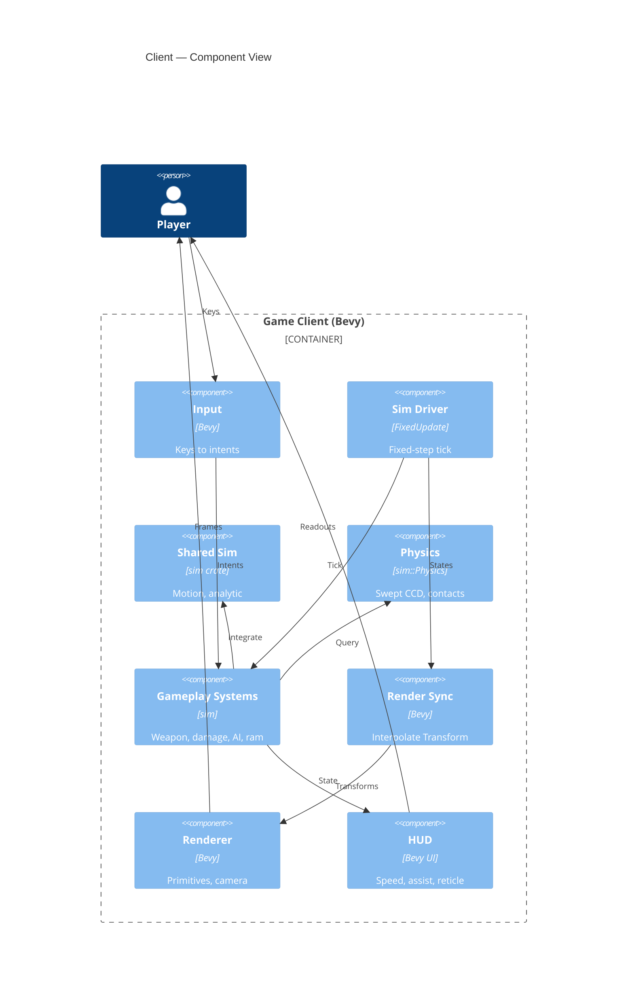

# Implementation Plan: Single-player Flight & Combat

**Branch**: `00002-single-player-flight-combat` | **Date**: 2026-06-01 | **Spec**: [spec.md](spec.md)

## Summary

**Goal**: A runnable single-player Bevy window proving momentum flight + shooting feels good (CAP-001 / Principle VII gate).
**Approach**: Thin Bevy client (input + render + HUD) drives the shared `sim` at a fixed timestep with interpolated rendering; gameplay logic lives in `sim` (ADR-0013).
**Key Constraint**: Subjective "feels good" feel (SC-008) — validated by hands-on playtest, not an automatable metric.

## Technical Context

**Language/Version**: Rust (edition 2021; toolchain 1.92.0)
**Primary Dependencies**: Bevy 0.18 (client render/window/input); reuses E001 `sim` (motion/components/`Physics` trait); `bevy_ecs` 0.18, `rapier2d` 0.32 (behind `sim::Physics`), `glam` 0.30, `serde` 1.0
**Storage**: N/A — in-memory ECS only; no persistence this epic
**Testing**: `cargo test` (pure-fn unit + headless-ECS integration), `clippy -D warnings`, `rustfmt`, `cargo-audit`; manual playtest for the feel gate
**Target Platform**: Desktop (Windows dev; Bevy cross-platform)
**Project Type**: single (game-client crate in the Cargo workspace)
**Project Mode**: brownfield (adds `crates/client`; extends `crates/sim`)
**Performance Goals**: 60+ FPS render; fixed sim tick (default 60 Hz logical); consistent feel across 30/60/144 FPS
**Constraints**: subtle-realistic feel; grounded-gameplay-scaled magnitudes (ADR-0012); no networking/persistence; keyboard-only; `sim` is the gameplay authority
**Scale/Scope**: single-player, one window; ~1 ship + a dozen targets + transient projectiles

## Instructions Check

*GATE: Must pass before Phase 0 research. Re-check after Phase 1 design.* — **PASS** (re-checked post-design).

- **I. Server-Authoritative** — N/A: single-player slice; a sanctioned Principle-I deferral (E003 owns authority). No client-authoritative state persists.
- **II. Shared Deterministic Sim Core** — PASS: all gameplay logic in `sim`; client is input/render/HUD only (AD-004, ADR-0013).
- **III. Tiered Simulation** — N/A: single Tier-0 bubble; no tier crossings.
- **IV. Agent Output Style** — PASS: table-first plan, ≤10KB.
- **V. Build the Seams** — PASS: gameplay components serde-derivable; in-memory single-node.
- **VI. Bandwidth Is the Budget** — N/A: no replication this epic.
- **VII. Playable Every Phase** — PASS: runnable window + SC-008 feel gate.
- **Tech Stack / Source Layout / Testing Policy** — PASS: Rust + Bevy + Rapier2D behind the `Physics` trait; `crates/sim` + new `crates/client` per ENFORCE_SRC_ROOT; the `sim` motion invariant stays covered by E001, new pure-fn + headless tests added, `clippy -D warnings` + `rustfmt` + `cargo-audit` enforced.

No violations → no Complexity Tracking section.

## Architecture



## Architecture Decisions

Feature-local tradeoffs only. Project-wide decisions are standalone ADRs — referenced, not copied.

| ID | Decision | Options Considered | Chosen | Rationale |
|----|----------|--------------------|--------|-----------|
| AD-001 | Fixed-step + interpolation mechanism | Bevy `FixedUpdate`/`Time<Fixed>` + `overstep_fraction()` / hand-rolled accumulator in `Update` | Bevy `FixedUpdate` + `overstep_fraction()` | Idiomatic, deterministic dt, least code; realizes ADR-0013. |
| AD-002 | Projectile collision method | Per-projectile Rapier dynamic body w/ CCD / per-step swept segment-cast via extended `sim::Physics` | Swept segment-cast (PrevPos→cur) through `Physics` | Deterministic, cheap, no per-projectile rigid body; matches ADR-0004 swept-ray CCD; trait is designed to grow here. |
| AD-003 | Ship↔asteroid bounce | Full Rapier rigid-body sim / `sim`-integrated kinematics + contact query + closed-form elastic impulse | Contact query via `Physics`; elastic impulse applied in `sim` | Keeps motion authoritative in `sim` (ADR-0003); Rapier used only for contact detection. |
| AD-004 | Gameplay code placement | Bevy client systems / shared `sim` headless `bevy_ecs` systems | Shared `sim`; client = input/render/HUD/camera only | Principle II + ADR-0013; avoids E003 rework. |
| AD-005 | Bevy version & dev iteration | bevy 0.18 default / bevy 0.18 + `dynamic_linking` dev feature | bevy 0.18, `dynamic_linking` as dev-only convenience | Matches `bevy_ecs` 0.18 already pinned (a second `bevy_ecs` version fails to build); dynamic linking speeds iterative builds. |

## Data Model Summary

| Entity | Key Fields | Relationships | Notes |
|--------|------------|---------------|-------|
| Ship (player) | `Position`, `Velocity`, `Heading`, `Health≥0`, `FlightAssist{On\|Off}`, `CollisionRadius` | has 1 Weapon; owns Projectiles; followed by Camera | `sim`; one/session; destroyed on lethal ram |
| Weapon | `cooldown`, `fire_rate>0`, `muzzle_speed>0` | 1:1 on Ship | `sim`; cooldown-gated; forward-mounted |
| Projectile | `Position`, `Velocity`, `PrevPosition`, `Damage>0`, `Lifetime≥0`, owner | N:1 → Ship; hits Targets (swept) | `sim`; despawns on hit or expiry |
| Target | `TargetKind{Dummy\|Asteroid\|Seeker}`, `Health≥0`, `CollisionRadius>0` (+`Velocity`/`Heading` per kind) | independent; Asteroid collides w/ Ship | `sim`; destroyed on `Health≤0` + feedback |
| RenderInterp (client) | `prev/curr_pos`, `prev/curr_heading` | 1:1 mirror of a sim entity | Bevy client only; lerps render `Transform` by `alpha` |
| Tuning (resource) | thrust/rotation/strafe, max_speed, muzzle_speed, fire_rate, lethal_ram_speed, assist_damping | global; read by sim systems | `sim` singleton; grounded-scaled (ADR-0012), in-engine tunable |

**Detail**: [data-model.md](data-model.md)

## API Surface Summary

N/A — no API surface (single-player, no networking this epic).

## Testing Strategy

| Tier | Tool | Scope | Mock Boundary | Install |
|------|------|-------|---------------|---------|
| Unit | cargo test | Pure `sim` fns: flight-assist transform, swept segment-vs-circle, elastic bounce impulse, ram threshold, seek steering, weapon cooldown | No Bevy App / no render | configured |
| Integration | cargo test (headless `bevy_ecs` World / Bevy `App` + MinimalPlugins, manually-advanced `Time<Fixed>`) | Systems: fire→swept-hit→despawn, ram→destroy, assist on/off velocity behavior, fixed-step determinism; extended `Physics` swap-equivalence | No window/GPU | configured |
| Security | cargo-audit | Dependency vuln scan (Bevy adds a large tree) | — | configured (`.cargo/audit.toml`) |
| Coverage | cargo-llvm-cov | Non-gated; `sim` motion invariant stays covered by E001; report-only | — | configured |

**Subjective vs automatable boundary**: The SC-008 "feels good" gate is the ONLY subjective, manual-playtest aspect — specifically: overall flight weight/responsiveness, whether drift "reads" as intentional, deceleration deliberateness, and HUD readability/"no number spam" (SC-006). Everything else is asserted by automated tests: fixed-step determinism + tick rate (FR-016/FR-017), assist ON/OFF velocity behaviour and toggle no-snap (SC-002/INV-07), coasting steady-state (FR-002), swept no-tunneling incl. high-velocity/grazing/thin-target/simultaneous (FR-006/SC-003), damage→destroy→despawn-once (FR-007/INV-09), elastic bounce momentum conservation + ram threshold (SC-005), seek thrust direction (FR-012), and weapon cooldown. This split is the coverage contract — no feel aspect listed as automatable is left to the manual gate, and vice versa.

QC stack inherited from `project-instructions.md` + E001 (SAD baseline 2026-06-01) — identical Rust workspace, no new tooling researched.

## Error Handling Strategy

N/A — local single-player client; no API, external services, or untrusted-input validation surface. Window/asset-load init failures fall back to Bevy's default error logging.

## Integration Points

| Spec Reference | System/Service | Technical Approach | Contract |
|----------------|----------------|--------------------|----------|
| Depends on E001 | `sim` crate | `crates/client` + new `sim` gameplay modules consume `sim` motion (`integrate`/`analytic`/`BodyState`), components (`Position`/`Velocity`), and the `Physics` trait (extended with swept-cast + contact queries) | `crates/sim` public API (`lib.rs`) |

## Risk Mitigation

| Risk (from spec) | Likelihood | Impact | Mitigation | Owner |
|-------------------|------------|--------|------------|-------|
| Subtle-realistic feel is hard to land | M | H | All magnitudes in a `Tuning` resource (in-engine tunable); iterate against SC-008 playtest; sample input every frame, apply at fixed step (low latency); audio/visual feedback hooks | sim flight + client |
| Swept-collision tuning for thin/fast projectiles | M | M | Swept segment-cast via `Physics`; cap projectile speed + slightly inflate target hit-radii; explicit `crates/sim` unit tests (Testing Strategy Unit tier) for all four swept edge cases — high-velocity, grazing/tangent, thin/small-target (min inflated radius), and simultaneous multi-hit — each owned by the swept segment-vs-circle unit tests | sim collision |
| Bevy + Rapier build friction on this environment | M | M | Pin bevy 0.18 / rapier2d 0.32; apply build workarounds (CARGO_HTTP_CHECK_REVOKE, sandbox off, AV exclusion for `target/`); optional `dynamic_linking` for iteration | build/CI |

## Requirement Coverage Map

| Req ID | Component(s) | File Path(s) | Notes |
|--------|--------------|--------------|-------|
| FR-001 | Renderer, Camera, Ship | `crates/client/src/{scene,camera,render_sync}.rs`; `crates/sim/src/components.rs` | tinted primitives; top-down follow + zoom |
| FR-002 | Sim motion, Flight, Input | `crates/sim/src/{motion,flight}.rs`; `crates/client/src/input.rs` | thrust→accel→`integrate`; coast on release |
| FR-003 | Flight | `crates/sim/src/flight.rs`; `crates/client/src/input.rs` | `FlightAssist` On/Off transform; toggle key |
| FR-004 | Sim Driver, Render Sync | `crates/client/src/{main,render_sync}.rs` | `FixedUpdate` + interpolate; {AD-001, ADR-0013} |
| FR-005 | Weapon, Input | `crates/sim/src/weapon.rs`; `crates/client/src/input.rs` | fire along heading; fire key |
| FR-006 | Collision, Physics, Weapon | `crates/sim/src/{collision,physics,weapon}.rs` | swept segment-cast CCD; {AD-002} |
| FR-007 | Combat, HUD | `crates/sim/src/combat.rs`; `crates/client/src/{hud,scene}.rs` | health→damage→despawn + feedback |
| FR-008 | AI (drift), Scene | `crates/sim/src/{ai,motion}.rs`; `crates/client/src/scene.rs` | Dummy (static) + Asteroid (drift) |
| FR-009 | Collision, Physics | `crates/sim/src/{collision,physics}.rs` | contact query + elastic impulse; {AD-003} |
| FR-010 | Collision, Combat | `crates/sim/src/{collision,combat}.rs` | lethal ram-speed threshold |
| FR-011 | HUD | `crates/client/src/hud.rs` | speed/throttle, assist mode, reticle, hit feedback |
| FR-012 | AI, Scene | `crates/sim/src/ai.rs`; `crates/client/src/scene.rs` | `Seeker` thrust-toward-player |
| FR-013 | Input | `crates/client/src/input.rs` | keyboard mapping (thrust/rotate/strafe/assist/fire) |
| FR-014 | App | `crates/client/src/main.rs` | standalone session; no net/persistence |
| FR-015 | Tuning | `crates/sim/src/tuning.rs` | grounded-scaled tunable magnitudes; {ADR-0012} |
| FR-016 | Sim Driver, Tuning | `crates/client/src/main.rs`; `crates/sim/src/tuning.rs` | fixed 60 Hz logical tick (`Time<Fixed>`), defined assertable value; {AD-001} |
| FR-017 | Gameplay Systems | `crates/sim/src/{motion,flight,weapon,collision,ai}.rs` | bit-identical determinism under harness; integration determinism test; reuses E001 invariant |

## Project Structure

### Source Code

```text
~ Cargo.toml                       # + crates/client member; + bevy 0.18 in [workspace.dependencies]
crates/
  sim/
    ~ src/lib.rs                   # export new gameplay modules
    ~ src/components.rs            # + Ship/Heading/Health/FlightAssist/Projectile/Damage/Lifetime/PrevPosition/Target/TargetKind/Weapon/CollisionRadius
    ~ src/physics.rs              # extend Physics: swept cast + contact query; impl in RapierPhysics
    + src/flight.rs                # flight-assist modes + thrust/rotate/strafe application
    + src/collision.rs             # swept segment-vs-circle CCD; elastic 2-body impulse; ram threshold
    + src/weapon.rs                # fire logic, cooldown, projectile spawn
    + src/combat.rs                # health / damage / destroy
    + src/ai.rs                    # seek steering
    + src/tuning.rs                # Tuning resource
    ~ tests/physics_swap.rs        # + StubPhysics swept-cast/contact swap-equivalence
    + tests/gameplay.rs            # headless ECS: fire→hit→despawn, ram→destroy, assist behavior
  + client/Cargo.toml              # new binary crate; deps: bevy 0.18, sim, glam
    + src/main.rs                  # Bevy App; FixedUpdate (sim) + Update (render); wiring
    + src/input.rs                 # keyboard → sim intents; assist toggle; fire
    + src/render_sync.rs           # interpolate sim state → Transform (Time<Fixed> overstep)
    + src/camera.rs                # top-down follow + zoom
    + src/hud.rs                   # minimal HUD
    + src/scene.rs                 # spawn ship + targets; primitive meshes/materials
```

**Patterns to reuse**: E001 `sim` modular layout + co-located `#[cfg(test)]`; the `Physics` trait + `StubPhysics`/`RapierPhysics` swap-test pattern (extend for new methods); serde + `Component` derive set on new components.
**Tests to extend**: `crates/sim/tests/physics_swap.rs` (add swept-cast/contact swap-equivalence cases).
**Naming conventions**: snake_case modules, `glam::Vec2`, sector-relative coords; no Rapier/Bevy types in `sim` public signatures.

## Implementation Hints

- **[HINT-001]** Order: Extend the `Physics` trait (swept cast + contact) BEFORE the weapon/collision systems that depend on it; mirror every new method in `StubPhysics` or `tests/physics_swap.rs` won't compile.
- **[HINT-002]** Constraint: Keep ALL gameplay logic in `sim` (Principle II / ADR-0013); the Bevy client holds only input, render-sync, HUD, camera, scene-spawn — no motion/damage math.
- **[HINT-003]** Gotcha: Step the sim ONLY in `FixedUpdate` with `Time<Fixed>`; never frame-delta dt in `Update` (breaks the integrator↔analytic invariant). Interpolate render Transforms with `overstep_fraction()`.
- **[HINT-004]** Compatibility: Pin `bevy = "0.18"` to match `bevy_ecs = "0.18"` already in the workspace (a second `bevy_ecs` version fails to compile). Apply build-env workarounds (CARGO_HTTP_CHECK_REVOKE=false, sandbox off, AV exclusion for `target/`) — the heavy Bevy tree is what wedged E001.
- **[HINT-005]** Performance: Projectiles are swept `sim` entities (PrevPos→cur segment cast), not Rapier rigid bodies; cap projectile speed and slightly inflate target hit-radii to keep CCD robust against thin/fast tunneling.
