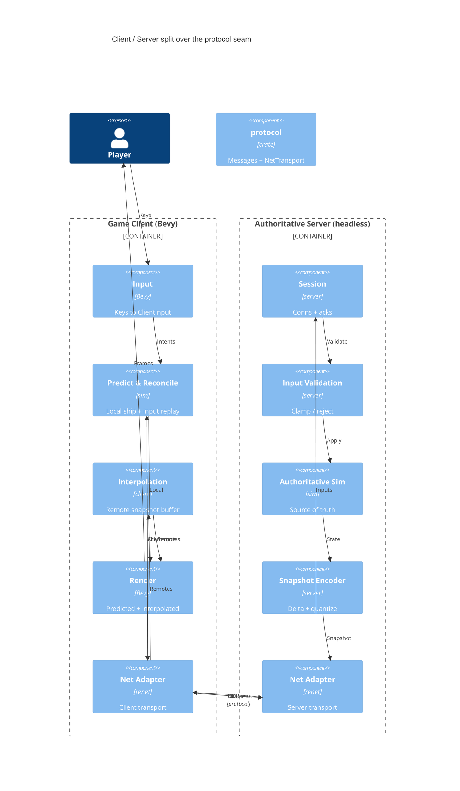

# Implementation Plan: Authoritative Networking

**Branch**: `00003-authoritative-networking` | **Date**: 2026-06-02 | **Spec**: [spec.md](spec.md)

## Summary

**Goal**: Split the E002 slice into an authoritative server + client that share the deterministic `sim`, with client prediction, server reconciliation, remote interpolation, input validation, and a bandwidth baseline.
**Approach**: A new `protocol` crate (wire messages + a library-agnostic `NetTransport` trait + in-memory loopback) and a headless `server` crate; the netcode library (renet) is confined behind the adapter; we own prediction/reconciliation/interpolation/snapshots (ADR-0014).
**Key Constraint**: Cross-machine determinism — reconciliation depends on the shared fixed-step `sim` and re-seeding from authoritative snapshots.

## Technical Context

**Language/Version**: Rust (edition 2021; toolchain 1.92.0; MSVC toolchain on the Windows dev host)
**Primary Dependencies**: `renet` 2.0 + `renet_netcode` (UDP) + `bevy_renet`, confined behind `protocol`'s `NetTransport` adapter (ADR-0014); `bitcode` (snapshot encoding); reuses `sim` (E001), extends `client` (E002); `bevy_ecs` 0.18 (headless server), `bevy` 0.18 (client), `glam`, `serde`
**Storage**: N/A — no persistence this epic (E004)
**Testing**: `cargo test` (pure-logic unit + headless-bot integration over the in-memory loopback, with simulated loss/jitter), `clippy -D warnings`, `rustfmt`, `cargo-audit`
**Target Platform**: Desktop Bevy client + headless native server; Windows dev (MSVC)
**Project Type**: multi-process (client + server) in the Cargo workspace
**Project Mode**: brownfield (adds `crates/protocol` + `crates/server`; modifies `crates/client`; reuses `crates/sim`)
**Performance Goals**: 30 Hz authoritative tick; 15–20 Hz snapshots (baseline 20 Hz); ~100 ms client interpolation — all server-announced defaults, no rate negotiation (TR-044); baseline bytes/client/sec **and** per-client snapshot encode cost measured + recorded over the renet UDP path, recorded-only, no budget gate (TR-046/047; budget is E009)
**Constraints**: server-authoritative; netcode library isolated behind the adapter (swappable); UDP delta snapshots; deterministic shared `sim`; single-node; no AOI/persistence/time-dilation in this epic
**Scale/Scope**: a 2-client + bots baseline session; ~dozens of entities

## Instructions Check

*GATE: Must pass before Phase 0 research. Re-check after Phase 1 design.* — **PASS** (re-checked post-design).

- **I. Server-Authoritative** — PASS (realized): server is the single source of truth; all input validated (OBJ1/OBJ5).
- **II. Shared Deterministic Sim Core** — PASS: the same `sim` runs on server and client; reconciliation depends on it (no forked logic).
- **III. Tiered Simulation** — N/A: tiers/dilation deferred to E008/E009.
- **IV. Agent Output Style** — PASS: table-first plan, ≤10KB.
- **V. Build the Seams** — PASS: single-node; netcode isolated behind `protocol`/`NetTransport` (renet swappable); entities serde-derivable.
- **VI. Bandwidth Is the Budget** — PASS (staged): E003 measures baseline bytes/client/sec + delta/quantized snapshots; AOI/per-client budget deferred to E009 (ADR-0006).
- **VII. Playable Every Phase** — PASS: loopback mode keeps solo play runnable.
- **Tech Stack / Source Layout / Testing Policy** — PASS: renet behind `protocol` (ADR-0014/0007); new `server` + `protocol` sibling crates per ENFORCE_SRC_ROOT; headless-bot harness + clippy `-D warnings` + rustfmt + cargo-audit.

No violations → no Complexity Tracking section.

## Architecture



## Architecture Decisions

Feature-local tradeoffs only; project-wide decisions are standalone ADRs (referenced).

| ID | Decision | Options Considered | Chosen | Rationale |
|----|----------|--------------------|--------|-----------|
| AD-001 | Netcode backend | renet transport + own netcode / lightyear framework / bevy_replicon / raw UDP | renet transport + own netcode | See **ADR-0014** (refines ADR-0007): we own prediction/reconciliation/interpolation; renet supplies only transport; more mature than lightyear; swappable behind the adapter. |
| AD-002 | Server runtime model | tokio async / synchronous fixed-tick `bevy_ecs` loop polling renet | Synchronous fixed-tick headless `bevy_ecs` app | renet is poll-driven; no async runtime needed; matches the deterministic fixed step; defer tokio to E004 (persistence IO). |
| AD-003 | Snapshot encoding | full-state / delta-vs-last-acked + `bitcode` quantized | Delta vs last-acked, `bitcode`, quantized `QVec2`/`QAngle` | Bandwidth baseline (ADR-0007 bitcode); unchanged entities ~1 bit; the figure E009 optimizes. |
| AD-004 | Loopback transport | real UDP only / in-memory `NetTransport` impl | In-memory transport implementing `NetTransport` | Deterministic, dependency-free solo/dev/tests (TR-003); the renet UDP adapter is tested separately on the loopback address. |
| AD-005 | Client under prediction | simulate all entities locally / predict own ship only, interpolate remotes | Predict own ship via `sim`; remotes interpolated (not locally simulated) | ADR-0002/0013: inter-player interactions are server-resolved, not predicted; avoids divergence. |
| AD-006 | Channel reliability mapping | all-reliable / per-message | Handshake reliable-ordered; `ClientInput` unreliable + redundant; `Snapshot` unreliable + delta + ack | Avoids head-of-line latency; UDP self-heals via redundancy/deltas (TR-006). **Security rationale**: the handshake (`Connect`/`ConnectAccepted`/`Disconnect`) is reliable-**ordered** so connection establishment and teardown cannot be spoofed or replayed mid-stream out of order — a duplicate/late `Connect` cannot fork or hijack an established session; the ordered channel is the integrity guarantee for session lifecycle, not only a latency choice (TR-024/025/026). |

## Data Model Summary

N/A — no persistent data. The runtime/wire types (`ClientInput`, `Snapshot`, `Session`, protocol messages) are defined in the `protocol` crate and documented in [contracts/protocol.md](contracts/protocol.md); they reuse E002's serde-derivable `sim` components.

## API Surface Summary

The "API" is the binary UDP wire protocol (not HTTP) — full catalog in [contracts/protocol.md](contracts/protocol.md).

| Message | Direction | Channel | Purpose | Types |
|---------|-----------|---------|---------|-------|
| `Connect` / `ConnectAccepted` / `ConnectRejected` | c↔s | reliable-ordered | Handshake, version check, session params | `protocol` |
| `ClientInput` | c→s | unreliable + redundant | Numbered pilot intents (prediction input) | `protocol`, `sim` intents |
| `Snapshot` | s→c | unreliable + delta | Authoritative entity state + input ack | `protocol`, quantized |
| `SnapshotAck` | c→s | unreliable | Baseline for delta encoding | `protocol` |
| `Disconnect` | c↔s | reliable-ordered | Clean teardown | `protocol` |

**Adapter**: `NetTransport` trait (connect/accept/send_reliable/send_unreliable/recv/disconnect/stats) — `protocol`/`glam`/`sim` types only; renet confined to the `renet_adapter` module body.

## Testing Strategy

| Tier | Tool | Scope | Mock Boundary | Install |
|------|------|-------|---------------|---------|
| Unit | cargo test | Pure logic: protocol message encode/decode round-trip equality (OBJ2 VC-1, independent of the bot harness, TR-043), snapshot delta+quantize round-trip, input buffer/seq, deterministic reconciliation replay, interpolation math, input validation (clamp/reject), **bit-identical determinism** (fixed seed + identical numbered input stream → both sims bit-equal after N ticks, TR-034/SC-007) | In-memory; no transport | configured |
| Integration | cargo test (headless bot harness over the in-memory loopback `NetTransport`, with simulated loss/jitter) | 2 sim clients + bots, ≥2 clients headless/no rendering; enumerated scenarios (TR-043): prediction responsiveness (SC-001); forced-mismatch reconciliation convergence (deterministic injection, ≤5-snapshot window, non-oscillating, no-teleport, TR-033/035/SC-002); per-class invalid-input rejection with byte-equal state assertion (TR-038/039/SC-003); smooth interpolation under the fixed loss/jitter conditions (5% single-packet loss + ±50 ms jitter + scripted consecutive-drop, no-jump signal, TR-036/037/SC-004); bytes/client/sec baseline over the fixed 30 s / 2 bot + 4 ship session, measured over the renet UDP path with mean+peak payload bytes-out emitted as structured test output (TR-042/046/SC-005), plus per-client snapshot encode-cost recorded alongside (recorded-only, no budget, TR-047); client-disconnect-mid-session clean-slot (TR-031). Loopback equivalence across the four named paths under matched loss-free conditions (TR-040/SC-008). A separate test exercises the renet UDP adapter bound to the loopback network address `127.0.0.1` (TR-041) | In-memory transport (no real UDP for deterministic-logic tests; a separate UDP-adapter test on `127.0.0.1`) | configured |
| Security | cargo-audit | Dependency vuln scan (renet + transitive) | — | configured (`.cargo/audit.toml`) |
| Coverage | cargo-llvm-cov | Non-gated; sim invariant stays covered by E001 | — | configured |

**Determinism scope (TR-032)**: bit-identical determinism is asserted ONLY in the deterministic in-memory loopback harness (same compiled `sim` + `FixedDt`, one host) — the unit/integration determinism test (TR-034) is the E003-split re-exercise of the E001 like-target bit-identical primitive; E003 does not re-prove cross-machine f32 reproducibility. Live cross-machine behavior is the bounded reconciliation of SC-002 (manual play-feel), not a bit-assertion.

QC stack inherited from `project-instructions.md` + E001 (SAD baseline).

## Error Handling Strategy

| Error Category | Pattern | Response | Retry |
|----------------|---------|----------|-------|
| Handshake / version mismatch | fail-fast | `ConnectRejected{reason}`; client surfaces error. Version compare is exact-match (TR-024); `full` at capacity ceiling (TR-025); `banned` reserved/deferred (TR-026) | no |
| Packet loss / jitter | absorb | Unreliable channels + redundant inputs + interpolation buffer; deltas re-baseline on ack | no (self-healing) |
| Malformed / undecodable packet | drop + log | Failed `bitcode` decode / unknown type / truncated / oversize-vs-MTU → drop, no state mutation, log offending conn (TR-029/030/031). NOT clamped | no |
| Invalid / out-of-bounds input | reject/clamp + log | Per-field: clamp analog `forward`/`strafe`/`turn`, fire-rate-gate `fire`, reject unknown enum (TR-020/021); replay/stale/out-of-order discarded by seq/tick (TR-022/023); authoritative state unaffected | no |
| Per-client flood (DoS) | rate-limit offender | Trigger: inbound message rate > baseline ~120 msg/s (4× send rate, TR-028) sustained over a 1 s window. Effect: excess packets dropped this window, offender flagged + logged (TR-031); repeated breach → disconnect. Distinct from per-input fire-rate gate (TR-021) | no |
| Client disconnect / timeout | graceful | Idle timeout 10 s with no received packet (TR-031) → server cleanly drops only that session and frees its slot; remaining clients + authoritative state unaffected (no slot leak) | no |
| Reconciliation divergence | correct | Re-seed local ship to authoritative snapshot, smooth; log if excessive | n/a |

Logging policy: rejected/invalid/malformed events log offending `ConnectionId`/`client_id`, reason category, and server tick (anti-cheat seed, TR-031); raw payloads and exact validation thresholds are not logged at default level (no exploitable leak).

## Integration Points

| Spec Reference | System/Service | Technical Approach | Contract |
|----------------|----------------|--------------------|----------|
| IP-001 | `sim` (E001) | Server + client both depend on `crates/sim`; identical fixed-step systems | `crates/sim` public API |
| IP-002 | E002 client | Networkize: input → `ClientInput`; render from prediction + interpolated snapshots | [contracts/protocol.md](contracts/protocol.md) |
| IP-003 | E009 (AOI) | `protocol` snapshot stream is the stable surface E009 will filter/prioritize | `protocol` crate |
| IP-004 | renet | `NetTransport` adapter; renet confined to `renet_adapter` module (ADR-0014) | `protocol::NetTransport` |

## Risk Mitigation

| Risk (from spec) | Likelihood | Impact | Mitigation | Owner |
|-------------------|------------|--------|------------|-------|
| Netcode-library maturity / API churn | M | M | renet 2.0 (more mature than lightyear), pinned; isolated behind `NetTransport`; bot-harness gates upgrades; bevy_replicon/aeronet documented fallback | protocol |
| Cross-machine determinism | M | H | One shared fixed-step `sim`; re-seed from authoritative snapshot each correction (tolerate drift); reuse E001 bit-identical determinism test | sim/client |
| Inter-player interaction misprediction | H | M | Predict own ship only; server resolves interactions; smooth corrections (ADR-0002) | client/server |

## Requirement Coverage Map

| Req ID | Component(s) | File Path(s) | Notes |
|--------|--------------|--------------|-------|
| TR-001 | Authoritative server | `crates/server/src/{main,session}.rs` | headless `bevy_ecs` app steps `sim` at fixed tick |
| TR-002 | Session | `crates/server/src/session.rs` | ≥2 clients in one world |
| TR-003 | Loopback transport | `crates/protocol/src/loopback.rs`; `crates/server/src/main.rs` | in-process embedded server; {AD-004} |
| TR-004 | Protocol messages | `crates/protocol/src/messages.rs` | `ClientInput`/`Snapshot`/handshake |
| TR-005 | Transport adapter | `crates/protocol/src/{transport,renet_adapter}.rs` | renet confined to impl; {AD-001, ADR-0014} |
| TR-006 | renet adapter | `crates/protocol/src/renet_adapter.rs` | UDP; redundant inputs; {AD-006} |
| TR-007 | Prediction | `crates/client/src/prediction.rs`; `crates/client/src/input.rs` | number inputs; predict via `sim` |
| TR-008 | Session, Snapshot | `crates/server/src/{session,snapshot}.rs` | per-client input ack in snapshots |
| TR-009 | Reconciliation | `crates/client/src/prediction.rs` | re-seed + replay; smoothed |
| TR-010 | Interpolation | `crates/client/src/interpolation.rs` | ~100 ms buffer |
| TR-011 | Input validation | `crates/server/src/validation.rs` | clamp/reject; {OBJ5} |
| TR-012 | Hit/authority | `crates/server/src/{validation,snapshot}.rs` | client positions/hits non-authoritative; server-resolved |
| TR-013 | Snapshot encoder | `crates/server/src/snapshot.rs`; `crates/protocol/src/quantize.rs` | delta + quantize @ 15–20 Hz; {AD-003} |
| TR-014 | Bandwidth metering | `crates/server/src/snapshot.rs`; `NetTransport::stats` | bytes/client/sec baseline |
| TR-015 | Bot harness | `crates/server/tests/` or `crates/tools/` (bot) | ≥2 networked clients, headless |
| TR-016 | Shared sim | `crates/sim/*` (reused) | identical both ends; determinism (E001 test) |
| TR-017 | Hit/authority (lag-comp) | `crates/server/src/validation.rs` | rewind = interp delay + RTT, capped 500 ms; baseline |
| TR-018 | Loopback validation parity | `crates/server/src/{session,validation}.rs`; `crates/protocol/src/loopback.rs` | same validation path; not a bypass; {AD-004} |
| TR-019 | Sim-constrained outcome | `crates/server/src/validation.rs`; `crates/sim/*` | validated-but-impossible → sim constraint governs |
| TR-020 | Per-field validation | `crates/server/src/validation.rs` | clamp/reject defined per field; {OBJ5} |
| TR-021 | Fire rate gate | `crates/server/src/validation.rs` | bound = sim weapon cooldown |
| TR-022 | Replay/stale discard | `crates/server/src/{session,validation}.rs` | seq/tick discard rules |
| TR-023 | Out-of-order handling | `crates/server/src/session.rs` | each seq applied at most once |
| TR-024 | Version exact-match | `crates/server/src/session.rs`; `crates/protocol/src/messages.rs` | `ConnectRejected{version}` |
| TR-025 | Session capacity | `crates/server/src/session.rs` | baseline cap 8; `ConnectRejected{full}` |
| TR-026 | Ban reason reserved | `crates/server/src/session.rs`; `crates/protocol/src/messages.rs` | reject+close; lifecycle deferred |
| TR-027 | Buffer bounds | `crates/client/src/{prediction,interpolation}.rs`; `crates/protocol/src/messages.rs` | input/snapshot/redundant-tail caps |
| TR-028 | Packet rate limit | `crates/server/src/{session,validation}.rs` | per-client inbound flood bound |
| TR-029 | Snapshot MTU bound | `crates/server/src/snapshot.rs` | ≤ MTU; no fragmentation |
| TR-030 | Malformed-packet drop | `crates/server/src/session.rs`; `crates/protocol/src/messages.rs` | decode-fail/unknown/truncated → drop+log |
| TR-031 | Logging + timeout | `crates/server/src/{session,validation}.rs` | anti-cheat-seed log (no leak); 10 s idle timeout |
| TR-032 | Determinism scope | `crates/server/tests/`; `crates/sim/*` (E001 test) | harness bit-identical vs live manual; ownership re-exercised at split |
| TR-033 | Reconciliation bounds | `crates/client/src/prediction.rs`; `crates/client/tests/` | ≤5-snapshot convergence window, non-oscillating, no-teleport `MAX_SNAP` (OD-001) |
| TR-034 | Determinism test inputs | `crates/server/tests/`; `crates/protocol/src/loopback.rs` | fixed seed + identical numbered input stream → bit-equal sims |
| TR-035 | Forced-mismatch injection | `crates/server/tests/` (harness) | scripted deterministic divergence (override / server-resolved ram) |
| TR-036 | Loss/jitter test conditions | `crates/protocol/src/loopback.rs`; `crates/client/tests/` | 5% loss + ±50 ms jitter + consecutive-drop; no-jump `MAX_INTERP_DELTA` (OD-001) |
| TR-037 | Stale/dup/out-of-order snapshot | `crates/client/src/interpolation.rs` | discard by `server_tick`; buffer advances monotonically |
| TR-038 | Per-class rejection tests | `crates/server/tests/`; `crates/server/src/validation.rs` | one enumerated case per invalid class |
| TR-039 | Rejection state-equality | `crates/server/tests/` | sim state byte-equal pre/post except ack bookkeeping |
| TR-040 | Loopback equivalence paths | `crates/server/tests/`; `crates/protocol/src/loopback.rs` | four named paths; transport-only diffs excluded |
| TR-041 | UDP-adapter coverage | `crates/protocol/tests/`; `crates/protocol/src/renet_adapter.rs` | separate test on `127.0.0.1` |
| TR-042 | Bandwidth baseline session | `crates/server/tests/`; `NetTransport::stats` | fixed 30 s / 2 bot + 4 ship / 20 Hz / seed; recorded-only |
| TR-043 | Harness scenario set | `crates/server/tests/` or `crates/tools/` (bot) | enumerated + traceable; ≥2 clients headless; round-trip unit test separate |
| TR-044 | Rate defaults + invariant | `crates/server/src/{main,session}.rs`; `crates/protocol/src/messages.rs` | 30 Hz tick / 15–20 Hz snap / 100 ms interp announced via `ConnectAccepted`; server-announced defaults (no negotiation); snapshot<tick asserted at start |
| TR-045 | Delta-encoding properties | `crates/server/src/snapshot.rs`; `crates/protocol/src/quantize.rs` | ≤1 bit unchanged-entity (unit-asserted); fixed quantize widths (deterministic size); lost-ack re-baseline / full keyframe (MTU-bounded) |
| TR-046 | Baseline measurement spec | `crates/server/tests/`; `NetTransport::stats` | measured over renet UDP path; payload bytes (transport headers excluded); mean+peak out emitted as structured test output |
| TR-047 | Per-client encode cost | `crates/server/src/snapshot.rs` (bench); `crates/server/tests/` | encoder benchmarkable; per-client cost recorded with bandwidth baseline; recorded-only, no budget gate (optimization E009) |

## Project Structure

### Source Code

```text
~ Cargo.toml                       # + crates/protocol, crates/server members; + renet/renet_netcode/bevy_renet/bitcode deps
+ crates/protocol/Cargo.toml       # deps: renet, renet_netcode, bevy_renet, bitcode, glam, serde, sim
    + src/lib.rs
    + src/messages.rs              # Connect/ClientInput/Snapshot/SnapshotAck/Disconnect (library-agnostic)
    + src/transport.rs            # NetTransport trait (glam/sim/protocol types only)
    + src/quantize.rs             # QVec2 / QAngle encode↔decode (bitcode)
    + src/loopback.rs             # in-memory NetTransport (deterministic tests/solo)
    + src/renet_adapter.rs        # RenetTransport: NetTransport (renet confined here)
+ crates/server/Cargo.toml         # deps: bevy_ecs, sim, protocol, glam
    + src/main.rs                  # headless app; fixed-tick loop: recv → validate → sim → encode → send
    + src/session.rs               # connections, per-client seq/ack bookkeeping
    + src/validation.rs            # input clamp/reject (TR-011/012)
    + src/snapshot.rs              # delta+quantize encode; bytes/client/sec (TR-013/014)
~ crates/client/                   # networkize the E002 client
    ~ src/main.rs                  # add net plugin; FixedUpdate: send input, recv, reconcile
    ~ src/input.rs                 # input → numbered ClientInput
    + src/prediction.rs            # local predict + input buffer + reconciliation (replay via sim)
    + src/interpolation.rs         # remote snapshot buffer + interpolate
    ~ src/render_sync.rs           # local from prediction, remotes from interpolation
+ crates/tools/ (or crates/server/tests/)  # headless bot harness (TR-015)
```

**Patterns to reuse**: E001's `sim::Physics`/`RapierPhysics` confinement pattern → apply to `NetTransport`/`RenetTransport` (engine/lib type never crosses the trait). E002's `FixedDt`/`ShipIntent`/components reused verbatim. Build over the **in-memory loopback first**, then the renet UDP adapter.
**Tests to extend**: none of E001/E002's tests change; add `crates/protocol` round-trip/loopback tests and the networked bot harness.
**Naming conventions**: snake_case modules; no renet/Bevy-app types in `protocol`/`sim` public surfaces.

## Implementation Hints

- **[HINT-001]** Order: build `protocol` (messages + `NetTransport` + in-memory loopback) and prove **prediction/reconciliation over loopback** (deterministic, no UDP) BEFORE wiring the renet adapter — de-risks the netcode logic from the transport.
- **[HINT-002]** Constraint: `protocol`'s public surface (`NetTransport`, messages) MUST name no renet type (SC-006); confine renet to `renet_adapter` (mirror the E001 `Physics`/`RapierPhysics` seam).
- **[HINT-003]** Gotcha: reconciliation needs the client's predicted `sim` and the server's authoritative `sim` to be the **same deterministic code + `FixedDt`**; reuse `crates/sim` unchanged and re-seed from each snapshot to absorb f32 drift.
- **[HINT-004]** Channels: map reliability per message (handshake reliable-ordered; `ClientInput` unreliable + redundant tail; `Snapshot` unreliable + delta + ack); never force everything reliable (head-of-line latency).
- **[HINT-005]** Compatibility: pin `renet`/`renet_netcode`/`bevy_renet` to the Bevy 0.18-compatible versions; the headless server is a `bevy_ecs` app polling renet each fixed tick (no tokio/async for E003); apply the MSVC + build-env workarounds (the new deps grow the build tree).
