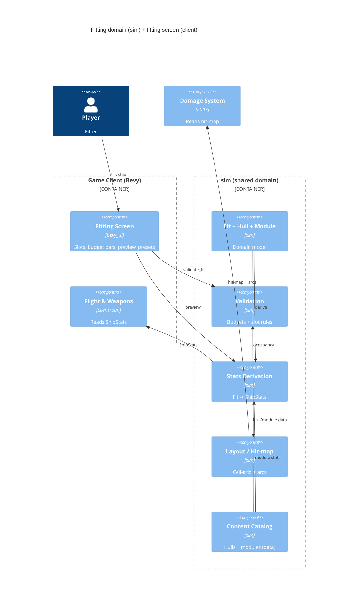

# Implementation Plan: Ship Fitting & Modules

**Branch**: `00006-ship-fitting-modules` | **Date**: 2026-06-02 | **Spec**: [spec.md](spec.md)

## Summary

**Goal**: A data-driven Module abstraction + positional-slot fitting where the fit drives the ship's flight & weapons and the fit layout is the hit/armor map.
**Approach**: Extend `crates/sim` with the Module/Hull/Fit domain (ADR-0008); a per-entity fit-derived `ShipStats` replaces the global `Tuning`; a Bevy-UI fitting screen in `crates/client`; the fit layout is a coarse 2D cell-grid queried as the E007 hit-map.
**Key Constraint**: Avoid a degenerate dominant fit (balance) and preserve E002 flight feel across the `Tuning`→`ShipStats` rewire.

## Technical Context

**Language/Version**: Rust (edition 2021; MSVC toolchain on the Windows dev host)
**Primary Dependencies**: `bevy_ecs` 0.18 (sim domain + systems), `bevy` 0.18 (client fitting-screen UI), `glam`, `serde`; reuses `sim` (E001) + `client` (E002)
**Storage**: N/A — no persistence this epic (fits/modules are in-memory `sim` data; data-driven content is embedded/loaded; persistence is E004)
**Testing**: `cargo test` (pure-logic unit + integration), `clippy -D warnings`, `rustfmt`, `cargo-audit`
**Target Platform**: Desktop Bevy client + headless `sim`; Windows dev (MSVC)
**Project Type**: single (Cargo workspace; the fitting "UI" is the `client` crate, not web/mobile)
**Project Mode**: brownfield (extends `crates/sim` + `crates/client`)
**Performance Goals**: fitting validation + stats derivation are per-fit-change (not hot-path); hit-map resolution must be cheap (grid raycast, read on hits → E007); client 60+ FPS
**Constraints**: domain logic in `sim` (Principle II); fitting UI in `client`; hull geometry designer-authored; fit-derived stats replace the global `Tuning`; content data-driven (FR-025); validation/derivation pure + server-authoritative at networked integration
**Scale/Scope**: seed ladder (2 hulls: fighter + corvette) + ~6 module archetypes; a fit is ≤ dozens of modules

## Instructions Check

*GATE: Must pass before Phase 0 research. Re-check after Phase 1 design.* — **PASS** (re-checked post-design).

- **I. Server-Authoritative** — PASS (forward note): E006 is pre-network; fit validation (`validate_fit`) + stats derivation are pure functions callable from both client preview and the eventual server authority — Fit validation/effective-stats become **server-owned** at networked integration (no client-authoritative assumption baked in).
- **II. Shared Deterministic Sim Core** — PASS: Module/Hull/Fit + validation/derivation/layout live in `crates/sim`; `ShipStats` drives the SAME shared flight/weapon systems (no forked client model).
- **III. Tiered Simulation** — N/A (no tiers/dilation).
- **V. Build the Seams** — PASS: hull authored as a coarse 2D cell-grid that is cell-upgrade-ready (ADR-0008) so E007 destructible hulls need no refactor; the fit layout is the queryable hit/armor map seam E007 reads.
- **VII. Playable Every Phase** — PASS: a flyable fitted ship + an interactive fitting screen are demoable.
- **Tech Stack / Source Layout** — PASS: domain as `sim` data, UI in `client`, content data-driven (ADR-0007/0008 / ENFORCE_SRC_ROOT).

No violations → no Complexity Tracking section.

## Architecture



## Architecture Decisions

Feature-local tradeoffs only; the project-wide unified domain model is **ADR-0008** (referenced, not duplicated).

| ID | Decision | Options Considered | Chosen | Rationale |
|----|----------|--------------------|--------|-----------|
| AD-001 | Where the fitting domain lives | new crate / in `sim` / in `client` | A new `fitting` module set inside **`crates/sim`** | Principle II — one model powers fitting+combat+economy (ADR-0008); server & client share it. |
| AD-002 | Hull layout representation | flat slot list / **2D cell-grid (section-granularity)** | 2D cell-grid grouped into sections/slots, the same grid for fitting + hit-map | ADR-0008 build-the-seams; coarse now, cell-upgrade-ready so E007 needs no refactor. |
| AD-003 | How the fit drives the ship | keep global `Tuning` + overrides / **per-entity derived `ShipStats`** | A per-entity `ShipStats` derived from the Fit, recomputed on change, read by flight/weapon systems in place of the global `Tuning` | Realizes "fit drives flight" (ADR-0008); retires the E002 `Tuning` stand-in; same flight-model formulae, fit-sourced inputs. |
| AD-004 | Validation surface | inline in UI / **pure `validate_fit(hull,fit)->FitValidation`** | Pure function returning per-axis usage + violations | Testable; reusable by client preview AND server authority (Principle I forward). |
| AD-005 | Hit-map / arc surface for E007 | bespoke per-consumer / **queryable layout (`resolve_hit`, `module_at`, `hardpoint_arc`)** | The Fit exposes occupancy + outer-before-inner hit resolution + per-hardpoint arc; E006 produces, E007 consumes | The ADR-0008 dependency contract (fit layout IS the hit/armor map). |
| AD-006 | Fitting UI | in-world overlay / **dedicated Bevy-UI fitting screen (app state)** | A client `bevy_ui` screen (slot widgets, live budget bars, green/red preview, presets) over the `sim` validation/derivation fns | Reuses Bevy UI; logic stays in `sim`, the screen is a thin view. |

## Data Model Summary

| Entity | Key Fields | Relationships | Notes |
|--------|------------|---------------|-------|
| Module | power gen/draw, cpu draw, mass, heat, health, hardpoint type/size, `ModuleKind` + specifics | installed into a Slot | uniform stat block; kinds: Reactor/Thruster/Weapon/Shield/Armor/Utility |
| Hull | 2D cell-grid, sections, budgets (power/cpu/mass cap), base mass, slot inventory | has Slots; referenced by Fit | designer-authored content; fighter + corvette seed |
| Hardpoint/Slot | type, size, grid coord, facing, (weapon) firing arc | belongs to Hull; holds a Module | type+size gate install |
| Fit | hull ref + slot→module map | on a ship entity; → ShipStats, FitLayout | validated/saved unit; empty hull = valid |
| ShipStats | top_speed/thrust/torque/total_mass/power/cpu/can_fire (+ weapon profile) | derived from Fit | **replaces global `Tuning`**; graceful floors (no NaN/inf) |
| FitValidation | per-axis BudgetUsage, Violation list, valid flag | over a Fit+Hull | over-budget axis / slot type/size mismatch |
| FitLayout / hit-map | cell → occupant (slot, module, health, depth) | from Fit | outer-before-inner occlusion; read by E007 |

**Detail**: [data-model.md](data-model.md) (in-memory `bevy_ecs` model; 14 invariants INV-F01..F14)

## API Surface Summary

Internal Rust (workspace) surface — **not HTTP**. Full catalog: [contracts/fitting-api.md](contracts/fitting-api.md).

| Surface | Consumer | Signature (conceptual) | Purpose |
|---------|----------|------------------------|---------|
| Validation | UI, future server | `validate_fit(hull, fit) -> FitValidation` | budgets + slot rules; empty = valid (FR-008/010/011) |
| Install/remove | UI, server | `install_module(...) -> Result<(),FitRejection>`, `remove_module(...)` | reject type/size/over-budget with reason (FR-005/006/007) |
| Budget readout | UI | `budget_usage(hull, fit) -> BudgetUsage` | live bars + before-commit preview (FR-009/013) |
| Effective stats | flight/weapon systems | `derive_ship_stats(hull, fit) -> ShipStats` | fit-derived flight+weapon, replaces `Tuning` (FR-014/015/016/017) |
| Hit-map | E007 | `resolve_hit(fit, seg) -> Option<(ModuleRef,toi)>`, `module_at`, `cell_map` | outer-before-inner hit resolution (FR-018/019/021) |
| Firing arc | E007/combat | `hardpoint_arc(hull, slot) -> Arc` | position-derived arc, defined here (FR-020) |
| Presets | client | `save_preset`/`load_preset`/`preview_stats` | save/name/reload/preview (FR-024) |

## Testing Strategy

| Tier | Tool | Scope | Mock Boundary | Install |
|------|------|-------|---------------|---------|
| Unit | cargo test | `validate_fit` (per-axis over-budget, slot type/size mismatch, empty-valid), `derive_ship_stats` (mass→agility, thrust→top speed, no-weapon→can't fire, crippled-fit floors), `resolve_hit` (outer-before-inner), arc derivation, no-degenerate-dominant-fit guard | none (pure logic) | configured |
| Integration | cargo test | seed-ladder tradeoffs (tank vs damage bind different axes; larger hull = more slots/power, more mass); fit→running-ship stats applied; preset save/reload round-trip | in-memory `sim` world | configured |
| Security | cargo-audit | dependency vuln scan (no new external surface) | — | configured |
| Coverage | cargo-llvm-cov | non-gated; fitting domain invariants covered by unit/integration | — | configured |

> The interactive fitting screen (Bevy UI) is compile-/structure-verified + manual playtest (cannot run headlessly); all fitting LOGIC is headless-tested via the pure `sim` functions.

## Error Handling Strategy

| Error Category | Pattern | Response | Retry |
|----------------|---------|----------|-------|
| Over-budget (power/CPU/mass) | reject + flag | block the change; name the violated axis; live bar shows overflow (FR-008/011) | no |
| Slot type/size mismatch | reject | placement refused with the mismatch reason (FR-006/007) | no |
| Crippled fit (no thrust/power) | graceful floor | derived stats clamp to defined minimums; never NaN/inf (FR-017) | no |
| Empty hull | accept | valid baseline fit (FR-010) | n/a |
| Invalid preset (incompatible hull) | fail-soft | reject load with reason; live ship unchanged (FR-024) | no |

## Integration Points

| Spec Reference | System | Technical Approach | Contract |
|----------------|--------|--------------------|----------|
| Assumptions / IP (E001) | `sim` (E001) | fitting domain added as `sim` modules; reuses `sim` components/world | `crates/sim` |
| Assumptions / IP (E002) | `client` flight/weapons (E002) | `ShipStats` replaces the global `Tuning`; `flight`/`weapon` systems read fit-derived stats | [contracts/fitting-api.md](contracts/fitting-api.md) |
| NEW-API (E007) | Damage & destruction (E007) | E007 reads the fit layout as the hit/armor map (`resolve_hit`/`module_at`) + arcs | [contracts/fitting-api.md](contracts/fitting-api.md) |
| NEW-ENTITY (E013/E014) | Economy / manufacturing | consume the `Module`/`Fit` model (later) | [data-model.md](data-model.md) |

## Risk Mitigation

| Risk (from spec) | Likelihood | Impact | Mitigation | Owner |
|-------------------|------------|--------|------------|-------|
| Degenerate dominant fit collapses tradeoffs | M | H | distinct per-module strength+cost; budgets that bind on different axes; an automated no-fit-maxes-all guard test (SC-005) over the seed catalog | sim/fitting |
| Flight-feel regression from `Tuning`→`ShipStats` rewire | M | M | derive `ShipStats` so the baseline seed fit reproduces the current `Tuning` defaults; keep the flight-model formulae unchanged; playtest-verify | sim/client |
| Cell-grid hit-map + interactive UI scope | M | M | coarse section-granularity grid (cell-upgrade-ready); minimal seed content; build sim logic first, UI last | sim/client |

## Requirement Coverage Map

| Req ID | Component(s) | File Path(s) | Notes |
|--------|--------------|--------------|-------|
| FR-001 | Module model | `crates/sim/src/fitting/module.rs` | uniform stat block + `ModuleKind` |
| FR-002 | Fit model | `crates/sim/src/fitting/fit.rs` | hull + slot→module; role emergent |
| FR-003 | Hull cell-grid | `crates/sim/src/fitting/hull.rs` | 2D grid = layout + hit-map |
| FR-004 | Hull budgets + slots | `crates/sim/src/fitting/hull.rs` | power/CPU/mass cap + slot inventory |
| FR-005 | Install/remove | `crates/sim/src/fitting/fit.rs` | place/remove module |
| FR-006, FR-007 | Slot type/size gate | `crates/sim/src/fitting/validate.rs` | reject mismatches |
| FR-008, FR-011 | Budget validation | `crates/sim/src/fitting/validate.rs` | `validate_fit` per-axis + violations |
| FR-009, FR-013 | Live budgets + preview | `crates/client/src/fitting_ui/*`; `validate.rs` `budget_usage` | bars + green/red deltas |
| FR-010 | Empty-hull baseline | `crates/sim/src/fitting/validate.rs` | valid baseline |
| FR-012 | Fitting screen | `crates/client/src/fitting_ui/*` | interactive place/remove + readouts |
| FR-014, FR-015, FR-016, FR-017 | Effective stats | `crates/sim/src/fitting/stats.rs`; `~crates/sim/src/{flight,weapon}.rs` | `derive_ship_stats`→`ShipStats`; systems read it; floors |
| FR-018, FR-019, FR-021 | Layout / hit-map | `crates/sim/src/fitting/layout.rs` | `resolve_hit`/`module_at`; outer-before-inner |
| FR-020 | Firing arc | `crates/sim/src/fitting/layout.rs` | `hardpoint_arc` from position |
| FR-022 | Seed content | `crates/sim/src/fitting/content.rs` | 2 hulls + 6 module archetypes |
| FR-023 | Tradeoff guard | `crates/sim/tests/fitting.rs` | no fit maxes tank+damage+speed |
| FR-024 | Presets/preview | `crates/client/src/fitting_ui/*`; `fit.rs` | save/name/reload/preview |
| FR-025 | Data-driven content | `crates/sim/src/fitting/{content,module,hull}.rs` | content as data, no code change to add |

## Project Structure

### Source Code

```text
+ crates/sim/src/fitting/mod.rs          # fitting domain entry (ADR-0008)
    + module.rs                          # Module stat block + ModuleKind
    + hull.rs                            # Hull 2D cell-grid + slots + budgets
    + fit.rs                             # Fit + install/remove
    + validate.rs                        # validate_fit / FitValidation / budget_usage
    + stats.rs                           # derive_ship_stats -> ShipStats (replaces Tuning)
    + layout.rs                          # FitLayout / hit-map / resolve_hit / hardpoint_arc
    + content.rs                         # seed hulls + module archetypes (data-driven)
~ crates/sim/src/lib.rs                  # register `fitting`; expose ShipStats
~ crates/sim/src/flight.rs              # read ShipStats instead of global Tuning
~ crates/sim/src/weapon.rs              # weapon params from fit (no weapon module -> no fire)
+ crates/sim/tests/fitting.rs           # validation/stats/hit-map/tradeoff tests
+ crates/client/src/fitting_ui/mod.rs    # Bevy-UI fitting screen (state, slots, budget bars, preview, presets)
~ crates/client/src/scene.rs            # spawn ship with a Fit + derived ShipStats
~ crates/client/src/main.rs             # add fitting-screen app state/plugin
```

**Patterns to reuse**: E001's `sim::Physics`/`RapierPhysics` trait-confinement + pure-math style (apply to `resolve_hit`); E002's `Tuning`/flight-model formulae (kept; only the *source* of the inputs changes to `ShipStats`); E002 component-on-entity pattern (the ship gains `Fit` + `ShipStats`).
**Tests to extend**: none of E001/E002's tests change; add `crates/sim/tests/fitting.rs`. The E002 flight tests must stay green (baseline seed fit reproduces current `Tuning`).
**Naming conventions**: snake_case modules; domain in `sim`, UI in `client`; no Bevy-app types in `sim` public surfaces.

## Implementation Hints

- **[HINT-001]** Order: build the `sim` fitting domain + its pure-logic tests FIRST (module/hull/fit/validate/stats/layout), THEN the `Tuning`→`ShipStats` rewire of flight/weapon, and the Bevy fitting **UI last** (it can't be headless-tested).
- **[HINT-002]** Gotcha: the `Tuning`→`ShipStats` rewire MUST reproduce E002 feel — tune the baseline seed fit so `derive_ship_stats` yields the current `Tuning` defaults; do NOT change the flight-model formulae. Verify the E002 flight tests stay green + a playtest.
- **[HINT-003]** Constraint: validation + stats derivation are **pure functions** (no world mutation) so the client uses them for preview and the eventual server uses them for authority (Principle I forward note) — keep them callable from both.
- **[HINT-004]** Compatibility: author the hull cell-grid at coarse section-granularity but cell-upgrade-ready (ADR-0008) so E007 destructible hulls upgrade whole-section→per-cell without a data-model refactor.
- **[HINT-005]** Constraint: keep degenerate-fit balance honest — the no-fit-maxes-all guard test (FR-023/SC-005) runs over the seed catalog so a content/balance change that creates a dominant fit fails CI.
