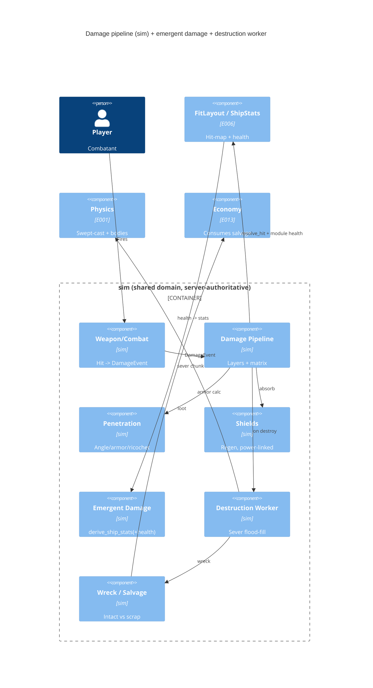

# Implementation Plan: Damage & Destruction

**Branch**: `00007-damage-destruction` | **Date**: 2026-06-02 | **Spec**: [spec.md](spec.md)

## Summary

**Goal**: Typed hit-location damage through layered defenses + angle penetration, emergent module degradation, coarse destruction + connectivity severing, and clean-sever salvage.
**Approach**: A server-side damage pipeline in `crates/sim` (`DamageEvent` → Shields→Armor→Hull→Systems + a data-driven resistance matrix + WoWs-core penetration) that reads E006's `FitLayout`/`resolve_hit`; emergent damage extends `derive_ship_stats(+&FitLayout)`; a destruction-event worker runs flood-fill severing → wreck chunks + salvage.
**Key Constraint**: Balance (non-degenerate matrix + grounded-scaled lethality, ADR-0012) and severing perf/physics (connectivity only on destruction).

## Technical Context

**Language/Version**: Rust (edition 2021; MSVC toolchain on the Windows dev host)
**Primary Dependencies**: `bevy_ecs` 0.18 (sim damage domain + systems), `bevy` 0.18 (client combat feedback), `glam`, `serde`; reuses `sim` (E001/E002/E006), the E003 server runs it
**Storage**: N/A — no persistence this epic (wrecks/salvage are in-memory world entities; durable persistence is E004, the salvage economy is E013)
**Testing**: `cargo test` (pure-logic unit + integration), `clippy -D warnings`, `rustfmt`, `cargo-audit`
**Target Platform**: Desktop Bevy client + headless `sim`; Windows dev (MSVC)
**Project Type**: single (Cargo workspace)
**Project Mode**: brownfield (extends `crates/sim`; reuses E006 `FitLayout`/E001 `Physics`/E002 combat)
**Performance Goals**: damage resolution is per-hit (cheap pure math); connectivity severing + chunk-spawn run ONLY on destruction events (not per frame); client 60+ FPS
**Constraints**: server-authoritative (FR-021); model in `sim` (Principle II); data-driven matrix/penetration/armor/shield values; grounded-gameplay-scaled lethality (ADR-0012); coarse module/section destruction, cell-grid-ready (ADR-0008); reuse swept-ray CCD (no tunnel)
**Scale/Scope**: 5 channels × 4 layers; coarse sections; ~dozens of entities/chunks per fight

## Instructions Check

*GATE: Must pass before Phase 0 research. Re-check after Phase 1 design.* — **PASS** (re-checked post-design).

- **I. Server-Authoritative** — PASS: all damage/penetration/destruction/severing/salvage resolve in the shared `sim`/server (FR-021), reusing the swept-ray CCD; client feedback is presentation-only.
- **II. Shared Deterministic Sim Core** — PASS: the damage domain lives in `crates/sim`; it reuses E006 `FitLayout`/`resolve_hit`/per-module health and **extends** `derive_ship_stats` (one model, not a fork).
- **III. Tiered Simulation** — N/A (severing is local Tier-0 physics; no tier-boundary state).
- **V. Build the Seams** — PASS: coarse section destruction, cell-grid-ready (ADR-0008); AOI-scaled replication deferred to E009.
- **VII. Playable Every Phase** — PASS: hit-location combat + emergent degradation + ships coming apart are demoable.
- **Tech Stack / Source Layout** — PASS: a new `sim::damage` module set; data-driven content; reuses E001/E002/E006.

No violations → no Complexity Tracking section. (The `derive_ship_stats(+&FitLayout)` signature change is a tracked BREAKING-CHANGE within `sim`, not a principle violation — see AD-004 / HINT-002.)

## Architecture



## Architecture Decisions

Feature-local tradeoffs only; the project-wide unified model is **ADR-0008**, grounded-scaling is **ADR-0012** (referenced, not duplicated).

| ID | Decision | Options Considered | Chosen | Rationale |
|----|----------|--------------------|--------|-----------|
| AD-001 | Damage pipeline shape | inline in weapon system / **a pure `apply_damage` pipeline in `sim::damage`** | A `DamageEvent` traversing Shields→Armor→Hull→Systems via pure functions | ADR-0008 unified model; testable, server-authoritative, reusable. |
| AD-002 | Resistance matrix | hardcoded per channel / **data-driven (layer × channel) flat-% table** | A data table (const/Resource), gameplay-scaled | Readable, tunable, the non-degenerate guard runs over it (FR-023). |
| AD-003 | Penetration model | binary pen / **WoWs core (eff-armor = thickness/cosθ, ricochet, overmatch, pen/overpen tiers)** | Pure functions over hit geometry + armor + shot; route post-pen to the module behind via E006 `resolve_hit` | CAP-004's "believable hit-location armor"; bounded; deeper mechanics deferred. |
| AD-004 | Emergent damage | parallel damage-stat model / **extend `derive_ship_stats` with `&FitLayout` (per-module health scales contribution)** | A module's health fraction scales its `ShipStats` contribution; destroyed = off | One model (Principle II); the GDD "damage is emergent". **BREAKING** signature change (HINT-002). |
| AD-005 | Destruction + severing | per-frame connectivity / **flood-fill ONLY on a destruction event → spawn disconnected regions as physics bodies** | A destruction-event worker; chunks reuse the `Physics` trait + inherit COM momentum | FR-017 perf; ADR-0008 severing; no per-cell collider rebuild. |
| AD-006 | Shields | flat layer / **regenerating, power-linked pool** | A `Shields` component + a regen system gated by `ShipStats` power; depleted/unpowered exposes armor | FR-010; ties shields to the reactor (emergent: lose power → lose shields). |
| AD-007 | Unfitted targets | force-fit everything / **fitted → full pipeline; unfitted (dummies/asteroids) keep simplified whole-ship `Health`** | A degenerate single-layer path for non-fitted entities | Keeps E002/E003 targets + tests green; only ships have hit-location. |

## Data Model Summary

| Entity | Key Fields | Relationships | Notes |
|--------|------------|---------------|-------|
| DamageEvent | channel, magnitude, penetration, pen_size, impact point/dir | flows the layers | the typed packet (FR-001) |
| Channel | Kinetic / ThermalEnergy / Blast / Em / Radiation | resisted per layer | data-driven matrix |
| ResistanceMatrix | (layer × channel) flat-% | Resource/const | non-degenerate (INV-D11) |
| Shields / SectionArmor / HullStructure | current/max/regen/power_linked; thickness/material; structure HP | on the ship; Systems = E006 module health | the 4 layers |
| PenetrationResult | Ricochet / NonPen / Penetration(tier) / OverPen(tier), eff-armor | from angle/armor calc | routes survivor behind |
| Section/Module health | the E006 `FitLayout`/`CellOccupant.health` | scales `ShipStats` | NOT a parallel store |
| Wreck / Chunk | Position/Velocity/Heading + COM momentum; salvageable contents | severed region / dead ship | persistent, lootable |
| SalvageItem | IntactModule(ModuleId) \| Scrap(amount) | from a Wreck | clean-sever vs through-kill |

**Detail**: [data-model.md](data-model.md) (in-memory `bevy_ecs`; 17 invariants INV-D01..D17)

## API Surface Summary

Internal Rust (workspace) surface — **not HTTP**. Full catalog: [contracts/damage-api.md](contracts/damage-api.md).

| Surface | Consumer | Signature (conceptual) | Purpose |
|---------|----------|------------------------|---------|
| Damage pipeline | weapon/combat systems | `apply_damage(world, target, DamageEvent) -> DamageOutcome` | resolve hit → layers+matrix → penetration → module damage → destroy (FR-002/003/009/011) |
| Penetration | pipeline | `resolve_penetration(thickness, angle, pen, size) -> PenetrationResult` | eff-armor/ricochet/overmatch/tiers (FR-005/006/007/008) |
| Resist lookup | pipeline | `layer_resist(matrix, layer, channel) -> f32` | data-driven mitigation (FR-004/022) |
| Shields | pipeline + system | `shield_absorb(...)` + `shield_regen_system` | power-linked regen/absorb (FR-010) |
| Emergent damage | flight/weapon systems | `derive_ship_stats(&Hull, &Fit, &ModuleCatalog, &FitLayout) -> ShipStats` | health scales contribution (FR-012/013) **[BREAKING]** |
| Severing | destruction worker | `on_section_destroyed(world, ship, section)` → `connected_region` + `sever_chunk` | flood-fill split → chunks, COM momentum (FR-014/015/016/017) |
| Salvage | E013 (later) | `salvage(&Wreck) -> Vec<SalvageOutcome>` | intact vs scrap, over-kill ≥ scrap (FR-018/019/020) |
| Weapon→event | weapon system | `damage_event_from_hit(weapon, hit) -> DamageEvent` | replaces E002 whole-ship `Health` for fitted ships (FR-001) **[BREAKING]** |

## Testing Strategy

| Tier | Tool | Scope | Mock Boundary | Install |
|------|------|-------|---------------|---------|
| Unit | cargo test | `resolve_penetration` (eff-armor, ricochet threshold, overmatch, pen/overpen tiers), `layer_resist`/matrix traversal, shield absorb+regen+power-link, emergent `derive_ship_stats` (health→contribution, destroyed=off), connectivity flood-fill (split/no-split, COM momentum), salvage (clean-sever intact vs through-kill scrap, over-kill ≥ scrap), the **non-degenerate matrix guard** (FR-023) | none (pure logic) | configured |
| Integration | cargo test | end-to-end: a fired projectile → hit → pipeline → module damage → emergent stat drop → section destroyed → sever → wreck → salvage, in a `sim` world; unfitted-target degenerate path; E006/E002 regression (fitting tests pass with the new `derive_ship_stats` signature) | in-memory `sim` world | configured |
| Security | cargo-audit | dependency vuln scan (no new external surface) | — | configured |
| Coverage | cargo-llvm-cov | non-gated; damage invariants covered by unit/integration | — | configured |

## Error Handling Strategy

| Error Category | Pattern | Response | Retry |
|----------------|---------|----------|-------|
| Hit on empty grid cell (no module behind) | absorb/pass | hull/structure absorbs, or over-penetrates into space — never a crash (Edge Cases) | no |
| Over-kill (already-destroyed target) | bound | excess damage clamped; ship still leaves ≥ scrap (FR-020) | no |
| Unpowered shields (reactor lost) | expose | shields drop, armor layer exposed immediately (FR-010/013) | n/a |
| Core severed | destroy | ship → persistent wreck; no orphaned ghost ship (INV-D15) | no |
| Orphan single cell on sever | clean | severs as a chunk or is absorbed — no dangling fragment (INV-D09) | no |
| Effective armor at grazing angle (cos→0) | clamp | effective armor capped finite (INV-D03) | no |

## Integration Points

| Spec Reference | System | Technical Approach | Contract |
|----------------|--------|--------------------|----------|
| Assumptions (E006) | fitting (E006) | reads `FitLayout`/`resolve_hit`/`cell_map` + per-module health; **extends** `derive_ship_stats(+&FitLayout)` | [data-model.md](data-model.md) / [contracts/damage-api.md](contracts/damage-api.md) |
| Assumptions (E001) | `Physics` (E001) | swept-cast for hit CCD; `Physics`/`BodyState` for severed chunk bodies | `sim::Physics` |
| BREAKING (E002) | combat/weapon (E002) | replaces whole-ship `Health`/`Target` destruction with per-module hit-location damage for fitted ships | [contracts/damage-api.md](contracts/damage-api.md) |
| NEW-ENTITY (E013) | economy (E013) | wrecks/salvage entities consumed later (markets out of scope) | [data-model.md](data-model.md) |
| FR-021 (E003) | server (E003) | the authoritative server's `sim` schedule runs the pipeline + destruction worker | `crates/server` |

## Risk Mitigation

| Risk (from spec) | Likelihood | Impact | Mitigation | Owner |
|-------------------|------------|--------|------------|-------|
| Balance complexity / degenerate matrix | M | H | flat-% data-driven matrix; the non-degenerate guard test (FR-023/SC-005) over the matrix; penetration tiers (not binary); grounded-scaled tuning (ADR-0012) | sim/damage |
| Severing physics/perf | M | M | connectivity only on destruction (FR-017); coarse granularity; reuse `Physics` trait; inherit COM velocity; no per-cell collider rebuild | sim/damage |
| Lethality feel (grounded-scaled) | M | M | data-driven values + a feel playtest gate; ADR-0012 grounded magnitudes; tune in-engine | sim/client |

## Requirement Coverage Map

| Req ID | Component(s) | File Path(s) | Notes |
|--------|--------------|--------------|-------|
| FR-001 | DamageEvent | `crates/sim/src/damage/event.rs` | typed packet + `Channel` |
| FR-002, FR-009 | Pipeline/hit | `crates/sim/src/damage/layers.rs` | resolve_hit (E006) → module behind |
| FR-003 | Layer traversal | `crates/sim/src/damage/layers.rs` | Shields→Armor→Hull→Systems |
| FR-004, FR-022 | Resistance matrix | `crates/sim/src/damage/{resist,content}.rs` | data-driven (layer×channel) |
| FR-005, FR-006, FR-007, FR-008 | Penetration | `crates/sim/src/damage/penetration.rs` | eff-armor/ricochet/overmatch/tiers |
| FR-010 | Shields | `crates/sim/src/damage/shields.rs` | regen + power-linked |
| FR-011 | Module damage | `crates/sim/src/damage/layers.rs`; `~combat.rs` | reduce FitLayout health; destroy at 0 |
| FR-012, FR-013 | Emergent damage | `~crates/sim/src/fitting/stats.rs`; `~fitting/mod.rs`; `~weapon.rs` | `derive_ship_stats(+&FitLayout)`; destroyed=off |
| FR-014, FR-017 | Destruction | `crates/sim/src/damage/destruction.rs` | remove section; only on destroy |
| FR-015, FR-016 | Severing | `crates/sim/src/damage/sever.rs` | flood-fill → chunk + COM momentum |
| FR-018, FR-019, FR-020 | Salvage/wreck | `crates/sim/src/damage/salvage.rs`; `sever.rs` | intact vs scrap; persistent; over-kill ≥ scrap |
| FR-021 | Server-authoritative | `~crates/sim/src/lib.rs`; `~weapon.rs` | in the sim step; swept CCD |
| FR-023 | Matrix guard | `crates/sim/tests/damage.rs` | non-degenerate guard |
| FR-024 | Combat feedback | `~crates/client/src/hud.rs` | legible ricochet/pen/absorb cue (minimal) |

## Project Structure

### Source Code

```text
+ crates/sim/src/damage/mod.rs           # damage domain entry (ADR-0008/0012)
    + event.rs                           # DamageEvent + Channel
    + resist.rs                          # ResistanceMatrix + layer_resist
    + penetration.rs                     # resolve_penetration + PenetrationResult
    + layers.rs                          # apply_damage: Shields->Armor->Hull->Systems
    + shields.rs                         # Shields component + regen/absorb (power-linked)
    + destruction.rs                     # on_section_destroyed (only on destroy)
    + sever.rs                           # connectivity flood-fill + Wreck/Chunk + COM momentum
    + salvage.rs                         # salvage() + SalvageOutcome (intact vs scrap)
    + content.rs                         # data-driven matrix + penetration/armor/shield config
~ crates/sim/src/fitting/stats.rs       # derive_ship_stats(+&FitLayout): health scales contribution
~ crates/sim/src/fitting/mod.rs         # recompute on Changed<FitLayout>
~ crates/sim/src/weapon.rs              # weapon hit -> DamageEvent -> apply_damage
~ crates/sim/src/combat.rs              # fitted -> pipeline; unfitted target -> simple Health
~ crates/sim/src/lib.rs                 # register `damage`; add systems to the fixed step
+ crates/sim/tests/damage.rs            # penetration/layers/emergent/sever/salvage/non-degenerate
~ crates/sim/tests/fitting.rs           # update for the derive_ship_stats signature
~ crates/client/src/hud.rs              # minimal legible hit-outcome feedback (FR-024)
```

**Patterns to reuse**: E001's pure-math + `Physics`/`RapierPhysics` confinement (apply to `resolve_penetration` + `sever_chunk`); E006's `FitLayout`/`resolve_hit`/`derive_ship_stats` (read + extend); E002's `combat::apply_damage`/`destruction_system` (the path being replaced for fitted ships).
**Tests to extend**: `crates/sim/tests/fitting.rs` (the `derive_ship_stats` signature ripple — must stay green); E001/E002 motion/gameplay tests stay green (unfitted targets unchanged).
**Naming conventions**: snake_case modules; domain in `sim`; data-driven content; no Bevy-app types in `sim` public surfaces.

## Implementation Hints

- **[HINT-001]** Order: build the pure damage pipeline (event/channel/resist/penetration/layers/shields) + tests FIRST → the emergent-damage `derive_ship_stats(+&FitLayout)` ripple → the destruction/severing worker → salvage → combat integration (replace the E002 hit path) → the client feedback LAST.
- **[HINT-002]** Gotcha: `derive_ship_stats` gains a `&FitLayout` param (per-module health) — a BREAKING signature change rippling to `recompute_ship_stats_system`, `preview_stats`, and the E006 fitting tests; update them and keep `crates/sim/tests/fitting.rs` green (the baseline-reproduces-`Tuning` guard must hold at full module health).
- **[HINT-003]** Constraint: the connectivity flood-fill runs ONLY on a destruction event (FR-017); reuse the `sim::Physics` trait for chunk bodies + inherit COM linear+angular velocity (FR-016); never rebuild per-cell colliders.
- **[HINT-004]** Gotcha: keep unfitted practice targets (dummies/asteroids) on the simplified whole-ship `Health` path (degenerate single-layer) so E002/E003 targets + tests stay green; only fitted ships use the full pipeline.
- **[HINT-005]** Constraint: the resistance matrix + penetration/armor/shield values are data-driven + grounded-scaled (ADR-0012); the non-degenerate-matrix guard (FR-023/SC-005) runs over the matrix so a balance change that creates a dominant channel/layer fails CI.
