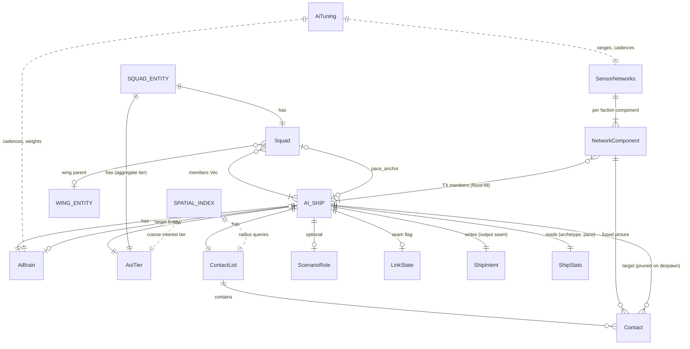

# Data Model: Ship AI Architecture (E011)

**Scope**: In-memory `bevy_ecs` domain model for the AI brain, squad/wing hierarchy, AOI sim-LOD tiers, perception/contacts, faction sensor network, scenario roles, and live tuning. **No database, no SQL, no persistence, no migrations** — `Storage = N/A`. All AI state is **ephemeral and re-derivable** from sim state (a brain rebuilt from scratch must converge to the same decisions); save/load is the persistence epic (E004). All new types derive `Clone + Debug` only — **NOT** `Serialize`/`Deserialize` in v1.

**Architecture rule (research.md)**: behavior state is an **enum field inside one brain component** — never per-state marker components (archetype thrash, table moves per transition). Re-evaluation is event/`Changed`-driven with a fallback cadence via `stable_id hash % N` phase buckets (deterministic only because the id is sim-stable, not `Entity` index).

## Reused `sim` Types (do NOT redefine)

| Type | Definition | Reuse in E011 |
|------|------------|---------------|
| `ShipIntent { forward, strafe, turn, fire_primary, fire_secondary, active_group, … }` | `sim/intent.rs` | **The OUTPUT seam.** Brains/steering write it; `ship_motion_system` consumes it (TR-001). Never mutate `Velocity`/`Heading` directly |
| `ShipStats` + `derive_ship_stats` | `sim/fitting/stats.rs` | READ-only input: fit-archetype classification (`Changed<ShipStats>`) + kinematics (top speed = `thrust_force/linear_drag`, turn authority) for pace-anchor + inertia-aware steering |
| `Faction`, `hostile()` | `sim/components.rs` | Targeting friend/foe gate; sensor-network grouping key |
| `Position`/`Velocity`/`Heading` | `sim/components.rs` | Steering inputs; cheap-glide mutates these directly (dormant tier ONLY) |
| `sim::broadphase` (fine grid) | `sim/broadphase.rs` | Near-tier sensor radius queries; E011 **adds a coarse interest tier** over it (AOI/LOD + far scans), build-once-read-many |
| `turret::aim_angle` | `sim/turret.rs` | Lead/intercept solver for gunnery + pursue-intercept steering |
| `energy_system` gates, `WeaponGroups` | `sim/` | Fire-control reads (never fire overheated/out-of-energy); fire-group selection writes `ShipIntent.active_group` |
| `RAM_CARVE_K` model | `sim/collision.rs` | Ram cost/benefit evaluation input |
| `ScenarioActive` | `sim/scenario.rs` | Gate on every new AI system (TR-016) |
| sever flood-fill precedent | `sim/damage.rs` | Pattern reused for sensor-network connected components |

## ECS Components (per-entity)

### `AiBrain` — Component on every AI-controlled ship

| Field | Type | Meaning / Determinism notes |
|-------|------|------------------------------|
| `behavior` | `Behavior` (enum) | Active behavior state. Enum-in-component; transitions mutate the field, never archetype |
| `target` | `Option<Entity>` | Current engage/follow target. Must be validated against despawn each read (no dangling reads) |
| `waypoint` | `Option<Vec2>` | Current nav goal (route step / squad slot goal) |
| `formation_slot` | `Option<u8>` | Index into the squad's `FormationDef.slots`; `None` = unassigned/solo |
| `commit_until_tick` | `u64` | Hysteresis/commitment timer — no re-selection before this tick unless an event fires |
| `last_think_tick` | `u64` | Last tick this brain evaluated; with the phase bucket gives ≈0 idle cost |
| `archetype` | `FitArchetype` (enum) | `Brawler / Kiter / Orbiter / Rammer / Support` — cached, recomputed ONLY on `Changed<ShipStats>` (TR-006). Mass re-classification (spawn wave / fleet-wide refit) is accepted unbatched: classification is a pure O(1) threshold function of `ShipStats` (no scans/queries), so a wave costs O(changed) trivial work in that tick |
| `think_tier` | `ThinkTier` (enum) | `Individual / SquadDriven / Dormant` — mirrors AOI tier; controls who thinks for this ship |
| `phase_bucket` | `u16` | `stable_id hash % bucket_count` — fallback-cadence slot. Derived from a sim-stable id, NOT `Entity` index |

### `Squad` — Component on its OWN entity (the squad brain)

| Field | Type | Meaning / Determinism notes |
|-------|------|------------------------------|
| `members` | `Vec<Entity>` | Scenario/spawner-authored at spawn (Clarification Q6); stable order = decision order. Pruned on member-death event, never reordered |
| `order` | `SquadOrder` (enum) | `MoveTo(Vec2) / Engage(Entity) / FormUp / Withdraw(Vec2)` — the squad-level decision members execute via O(1) steering |
| `pace_anchor` | `Option<Entity>` | Slowest ESSENTIAL member (from members' `ShipStats`) — "essential" = members whose fit-archetype role is core to the squad (non-screen: e.g. Brawler/Support heavies); fast screen/flank escorts are NON-essential for pacing. Re-derived on member-death event — killing the anchor MUST change squad pace; killing a non-essential screen must NOT (the OBJ3-VC4 fixture pair) |
| `wing` | `Option<Entity>` | Parent wing entity (large mixed fleets → role-coherent squads under a wing brain); `None` = independent |
| `formation` | `FormationDef` | Slot offsets relative to leader heading (`Vec<Vec2>`); members map by `formation_slot` |
| `last_think_tick` / `phase_bucket` | `u64` / `u16` | Same scheduler discipline as `AiBrain` (~0.5 s mid cadence) |

### `AoiTier` — Component (per AI ship AND per squad/aggregate entity)

| Field | Type | Meaning / Determinism notes |
|-------|------|------------------------------|
| `tier` | `Tier` (enum) | `Active / Mid / Dormant` — from authoritative player proximity over the coarse interest tier (TR-007; never a per-client camera) |
| `since_tick` | `u64` | Tick of last tier change — boundary hysteresis (no thrash); promote/demote only after `AiTuning.tier_hysteresis_ticks` |

Dormant groups move via cheap-glide on the **squad/aggregate entity**; members **stay live entities that systems SKIP** (AD-001 — fit/health/identity preserved, no despawn/spawn churn); promotion **re-enables** members at deterministic, continuous positions (TR-008). Default `tier_hysteresis_ticks` ≈ 30 (1 s @30Hz) — boundary thrash at the AOI edge is prevented by hysteresis and covered by the LOD classify/hysteresis unit tests (plan §Testing Strategy). **Thrash signal (TR-020)**: hysteresis bounds oscillation to at most one transition per entity per `tier_hysteresis_ticks`, so the TR-020 promotion/demotion rate counters distinguish health from thrash — a sustained per-entity transition rate NEAR that hysteresis-permitted maximum flags boundary oscillation, vs the low rates of normal player-movement traffic.

### `ContactList` — Component on AI ships (local perception)

| Field | Type | Meaning / Determinism notes |
|-------|------|------------------------------|
| `contacts` | `Vec<Contact>` | Sorted by stable target id (deterministic iteration; no HashMap) |
| `last_scan_tick` | `u64` | Tier-scaled cadence bookkeeping (Q4: near ≈ every think / mid ~0.5 s fused / far 2–5 s coarse) |

`Contact` (value type): `{ target: Entity, last_pos: Vec2, last_seen_tick: u64, signature: f32 }`. Signature = size scalar now; heat-signature feeds it later (IP-005). Contacts whose `target` despawned are pruned the same tick (validation rule V-1).

### `ScenarioRole` — Component (optional; scenario-scripted ships only)

| Field | Type | Meaning / Determinism notes |
|-------|------|------------------------------|
| `goal` | `ScriptGoal` (enum) | `PatrolRoute(Vec<Vec2>) / Ambush { trigger_radius: f32, anchor: Vec2 } / Defend { anchor: Vec2, radius: f32 }` |
| `posture` | `Posture` (enum) | `FreeEngage / DefensiveOnly / HoldFire` — fire-control gate layered over the brain |
| `route_index` | `u16` | Current patrol waypoint cursor (wraps) |

**Composition rule (OBJ6)**: the script sets goal + posture; the general brain fills tactics (utility selection runs WITHIN the scripted goal; threat-interrupt returns to the goal after).

## Resources (world-global)

### `SensorNetworks` — Resource (per-faction fused pictures)

| Field | Type | Meaning / Determinism notes |
|-------|------|------------------------------|
| `networks` | `Vec<NetworkComponent>` | Connected components over TRANSMITTING faction members (baseline TX+RX on every faction ship in v1 — Q3). Flood-fill in stable member order (sever-logic pattern, IP-007). Rebuild cadence: the flood-fill + fusion rebuild runs at the mid scan cadence (~0.5 s) and on `LinkState`/membership-change events — NOT every tick; per-component fusion = dedupe + stable sort, O(C log C) per rebuild, C capped by `AiTuning.max_fused_contacts` |
| `NetworkComponent.members` | `Vec<Entity>` | Linked ships/stations, sorted by stable id |
| `NetworkComponent.fused` | `Vec<Contact>` | The shared picture — union of member detections, deduped by target, newest `last_seen_tick` wins, stable-sorted |

Per-ship seam flag (separate tiny component): `LinkState { jammed: bool, severed: bool }` — **defaults `false/false`**; set by scenario/tests only in E011 (Q2; mechanic = CAP-007). EITHER flag true → the ship is excluded from the flood-fill (network connectivity only) → falls back to its own `ContactList`; the ship's OWN local sensing is unaffected in v1 — sensor-jamming is the CAP-007 layer (the "layered degradations" of spec OBJ5). Tests cover each flag independently (jam-fallback × `jammed`, × `severed`).

### `AiTuning` — Resource (live-editable, like `SimTuning`)

| Field group | Fields | Notes |
|-------------|--------|-------|
| Think cadence | `think_ticks_active / _mid / _dormant`, `fallback_bucket_count` | Per-tier cadences + phase-bucket count. Defaults (requirement-level budget): active fallback ≈ 0.5 s (15 ticks; events still react same-tick), mid ≈ 0.5 s, dormant 2–5 s (matches the Q4 scan cadences); `fallback_bucket_count` default 16 — the stable-id hash spreads brains ~uniformly so each tick services ≈ N/16, and squad scan phases are offset by squad-id hash so buckets don't align into one burst tick |
| AOI | `aoi_radius_active / _mid`, `tier_hysteresis_ticks`, `promote_nudge_max` | Tier boundaries + hysteresis; `promote_nudge_max` = the TR-008 validity-nudge bound (max de-penetration distance applied at promotion, default 1 fine-grid cell ≈ `CELL_WORLD_SIZE`) |
| Squads | `max_squad_size`, `wing_split_threshold` | Composition limits |
| Utility | `momentum_bonus` (~0.25), per-consideration curve params, compensation factor | Research: incumbent ~25% bonus; Mark's compensation for multiplied curves |
| Ramming | `ram_target_hull_frac`, `ram_self_margin`, `ram_min_closing` | Ram cost/benefit thresholds (TR-012). Defaults: `ram_target_hull_frac` 0.25 (target hull ≤ 25% = "near-dead/disabled"), `ram_self_margin` 2.0 (projected dealt ≥ 2× projected self-damage = "much weaker"), `ram_min_closing` 0.5 × attacker top speed — the pinned knobs the OBJ4-VC2 ram/no-ram fixtures are built against |
| Archetype | speed/agility/armor/dps thresholds | Fit→archetype classification cuts |
| Sensors | `base_sensor_range`, `datalink_radius`, `sig_threshold`, scan cadences (mid ~0.5 s, far 2–5 s), `max_fused_contacts` | v1 faction baseline (Q3/Q4). Per-tier scan budgets: near = fine-grid radius query bounded by sensor range (every think); mid = ONE fused radius query per squad per ~0.5 s; far = coarse-grid neighborhood query ≤ ~3×3 coarse cells per 2–5 s; `max_fused_contacts` caps each fused picture (keep newest/highest-signature, deterministic cut) |
| Steering | `slot_count` (8–16), danger-mask floor | Context-steering config |
| Debug | `debug_history_len` (default 16) | TR-020(a) transition-history bound (capture feature-gated off in headless/bench builds) |

All `f32` tuning is strict-f32 (no fast-math in scoring); the resource is deterministic input, not state.

**Live-edit semantics (TR-020)**: systems read `AiTuning` fresh each run, so an edit takes effect at each consumer's next execution (next think / scan / classify); it does NOT retroactively cancel an in-flight `commit_until_tick` commitment — new values apply at the next selection. Editing an **archetype threshold** triggers a deterministic mass re-classification of ALL brains (the dev-panel edit path marks brains changed — same pattern as the existing `force_rederive_all`), so stale cached archetypes never persist (V-5). Mass re-classification cost is the same accepted-unbatched case as a fleet-wide refit: a pure O(1) threshold function per brain, O(changed) trivial work in that tick (§`AiBrain.archetype`). Persistence follows the `SimTuning` pattern: saved/loaded as RON dev settings with `#[serde(default)]` per-field fallback, so a tuned configuration is reproducible; golden/bench runs use pinned defaults, and a mid-run edit invalidates comparability with previously recorded runs/goldens.

## State Machines

### `Behavior` enum — utility selection (research: Utility-FSM hybrid)

Variants: `Hold` (idle default) · `Patrol` · `Waypoint` · `Follow` · `FormationKeep` · `Engage` · `Evade` · `Retreat` · `Scout` · `Sweep` · `Ram`.

Selection = score each candidate via multiplied consideration response curves over normalized inputs, in **priority buckets evaluated highest-first** (survival > combat > movement > idle); the **incumbent gets a ~`AiTuning.momentum_bonus` (~25%)** multiplier; tiebreaks are **two-level**: within one ship's behavior selection, equal utility scores tiebreak by behavior-enum ordinal (stable, intra-ship); any cross-entity ordering/iteration tie (target choice, scheduling, fusion) tiebreaks by stable entity id (same layered rule as plan HINT-002). Re-evaluation only on **events** (hit taken, target lost, new contact, waypoint reached, order changed, member death) or the fallback phase-bucket tick — and never before `commit_until_tick` absent an event. Events COALESCE: any number of events in one tick trigger at most ONE think per brain per tick (`last_think_tick` guard), so the event-storm worst case is bounded at one think/ship/tick — and that sustained-combat worst case IS the TR-018 bench's measured gate case.

| From | To | Trigger (event / dominant consideration) |
|------|----|------------------------------------------|
| `Hold`/`Patrol`/`Waypoint` | `Engage` | New hostile contact within engagement envelope, posture permits (`FreeEngage`, or `DefensiveOnly` + fired-upon) |
| `Engage` | `Evade` | Incoming-threat score dominates (hit taken, shields low, outgunned locally) |
| `Engage` | `Ram` | Ram evaluation passes: target near-dead/disabled OR much weaker hull, closing² damage favorable, self-margin ok (TR-012) |
| `Engage`/`Evade` | `Retreat` | Survival bucket wins (hull critical / squad `Withdraw` order / scout doctrine vs superior threat) |
| `Engage` | `Patrol`/`Waypoint`/`Hold` | Target lost (despawn or perception-lost) → resume prior goal (`ScenarioRole.goal` if present) |
| `FormationKeep`/`Follow` | `Engage` | Squad order `Engage(target)` distributed to members |
| `Scout` | `Evade`→`Scout` | Perceived superior threat → disengage, resume coverage when clear (OBJ7) |
| `Sweep` | `Engage` | S&D: contact perceived in region |
| any | `Hold` | No live control source / no power → degrade (drift, cease fire); no valid behavior scores > 0 |

### Squad lifecycle (Clarification Q6)

| State | Transition | Trigger |
|-------|-----------|---------|
| `Authored` → `Active` | spawn | Scenario/spawner creates squad entity + members with `formation_slot`s |
| `Active` → `Active'` (re-derived) | member-death **event** | Prune `members`, re-derive `pace_anchor` + roles + slots that tick; squad does NOT dissolve |
| `Active` → `Degraded(solo)` | members.len() == 1 | Last member's `AiBrain.think_tier → Individual`, its `formation_slot` cleared to `None` and any squad-issued order converted to its own goal; the squad entity is despawned and the wing parent's squad list pruned the same tick (V-1) — end state has NO dangling refs (the assertable disposition) |
| `Active` ↔ `DormantAggregate` | AOI tier change (+hysteresis) | Collapse: members stay live entities, skipped by systems (AD-001); glide the squad entity. Expand: re-enable members at continuous deterministic positions (TR-008) — O(members) re-seed with no spawn churn, bounded by `max_squad_size`/wing size (mutual hostile promotion of two fleets = O(both memberships); bursts surface in the bench p99). Hostile far-scan detection promotes BOTH groups (Q1) |
| (never) re-cluster | — | No runtime cross-squad re-clustering in v1 |

## Validation Rules (invariants)

| ID | Rule |
|----|------|
| V-1 | No dangling `Entity`: `AiBrain.target`, `Contact.target`, `Squad.members`, `pace_anchor`, `wing`, fused pictures are pruned/cleared the tick their referent despawns — enforced by a dedicated despawn-sweep system ordered FIRST in the AI system set in `add_fixed_step_systems` (before perception/squad/brain systems); the test despawns a referent and asserts no AI system reads it that same tick |
| V-2 | `LinkState` defaults `{ jammed: false, severed: false }`; absence of the component = linked (v1 baseline participation) |
| V-3 | All entity collections sorted by sim-stable id; no `HashMap`/`HashSet` iteration anywhere in AI state |
| V-4 | `phase_bucket` derived from a sim-stable id — a monotonic spawn-order counter assigned by the deterministic spawn path at entity creation, never reused, identical across re-runs (spawn order is deterministic) — never `Entity` index/generation; the V-4 test re-runs a spawn sequence and asserts identical ids + buckets |
| V-5 | `archetype` recomputed only on `Changed<ShipStats>` — plus one dev-tool exception: an `AiTuning` archetype-threshold live edit marks ALL brains changed for a deterministic mass re-classification (`force_rederive_all` pattern, TR-020), so stale cached archetypes never outlive an edited threshold; per-think reads are branch-on-enum (no re-derivation) |
| V-6 | Dormant ships/groups are the ONLY entities mutating `Position`/`Velocity` outside `ship_motion_system`; Active/Mid ships write `ShipIntent` exclusively (TR-001) |
| V-7 | `formation_slot < formation.slots.len()` after every re-derive; orphan slots reassigned in member order |
| V-8 | Perception is signature-gated at EVERY tier (`signature >= sig_threshold(range)`); the sim-LOD tier never feeds the perception decision (TR-013 separation) |
| V-9 | All new components/resources `Clone + Debug`, no `Serialize` in v1; all systems `ScenarioActive`-gated (TR-016) |

ER Diagram (component references — visual reference)

