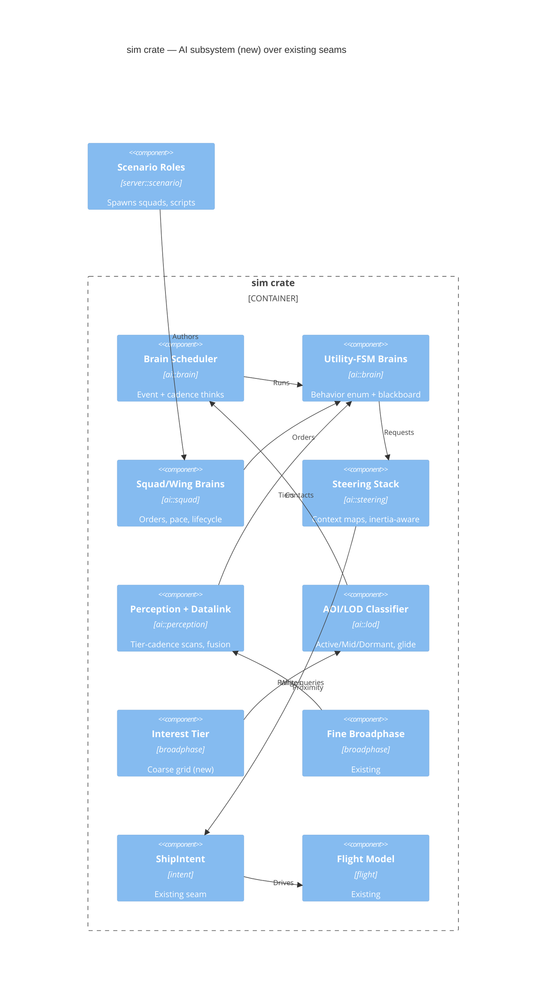

# Implementation Plan: Ship AI architecture — tiered autonomous behaviors at scale

**Branch**: `00008-ship-ai` | **Date**: 2026-06-10 | **Spec**: [spec.md](spec.md)

## Summary

**Goal**: A deterministic, intent-driven AI substrate (steering + utility-FSM brains + squad/wing/aggregate behavior-LOD + sensor-network perception) that gives the game real opponents and scales to big battles.  
**Approach**: New `sim::ai` module per ADR-0015 — brains write `ShipIntent` through the existing flight model; a coarse interest tier over the shared spatial index drives AOI/LOD; all systems additive + `ScenarioActive`-gated.  
**Key Constraint**: Golden determinism/demo/botkit tests stay bit-identical; AI overhead ≤ 30% (hard gate, player-local) of the no-AI `fleet_stress` baseline mean tick at the pinned N = 2000 @30Hz.

## Technical Context

**Language/Version**: Rust, edition 2021 (toolchain 1.92)  
**Primary Dependencies**: `bevy_ecs` 0.18 (shared `sim` crate), `glam`; no networking/persistence involvement  
**Storage**: N/A — AI state ephemeral + re-derivable from sim state; serialization deferred to the persistence epic  
**Testing**: `cargo test` (unit + sim integration), `clippy -D warnings`, `rustfmt`, golden determinism/`demo_enemies_smoke`/botkit bit-identical suites, `fleet_stress` bench  
**Target Platform**: shared `sim` crate — runs in the client-embedded loopback server and the headless server  
**Project Type**: single (multi-crate Cargo workspace game)  
**Project Mode**: brownfield  
**Performance Goals**: 30 Hz fixed tick (the gate is asserted @30Hz only; the 60Hz figure is informational); AI think + steering + perception ≤ 30% (hard gate) overhead vs the no-AI `fleet_stress` baseline mean tick at the pinned sustainable N = 2000 fighting ships/core @30Hz (the documented R57 pinned 2-gun configuration; warmup + pinning per the existing R57 bench methodology); the gate is **player-local** — auto-promoted off-screen battles are EXCLUDED from the ≤30% numerator but the bench separately measures + reports their cost (the STF-001 revisit signal); decision cost O(squads), not O(ships); the bench-derived absolute target N is an OUTPUT written back here (SC-003 refinement), not a gate  
**Constraints**: bit-identical determinism (no RNG / no HashMap iteration / stable order / strict-f32 scoring); full-physics AI controls ships ONLY via `ShipIntent`; LOD triggers key off authoritative ship positions (never a per-client camera); all new systems `ScenarioActive`-gated  
**Scale/Scope**: bench-derived target (TR-017 — an OUTPUT recorded in the `--ai` bench report and written back to Performance Goals/SC-003 as the absolute-target refinement); v1 scenario-scale squads, architecture sized for hundreds+ thinking ships/core

## Instructions Check

*GATE: passed pre-research; re-checked after Phase 1 design.*

| Gate (project-instructions) | Status | Evidence |
|---|---|---|
| I. Server-authoritative | PASS | AI runs in the authoritative sim; LOD keys off authoritative positions (TR-007) |
| II. Shared deterministic sim core | PASS | One `ShipIntent` code path (TR-001); strict-f32 + seeded hash + stable tiebreaks (research) |
| III. Tiered by attention | PASS (1 documented exception) | Active/Mid/Dormant behavior-LOD (ADR-0015); STF-001 exception below |
| IV. Agent output style | N/A | Artifact-format concern; plan follows template |
| V. Build seams, defer distribution | PASS | Coarse interest tier seeds sector-sharding (IP-002) |
| VI. Bandwidth is the budget | N/A | No new replication path (sim-side AI only) |
| VII. Playable every phase | PASS | P1 substrate alone = flyable waypoint/formation AI demo |
| Determinism doctrine (CRITICAL) | PASS | Additive `ScenarioActive`-gated systems; golden trio untouched (TR-016) |

## Complexity Tracking

| Violation | Why Needed | Simpler Alternative Rejected Because |
|---|---|---|
| STF-001: off-screen auto-promoted combat runs full physics unbounded (cost can scale with world activity, not player attention — a Principle III deviation) | User-accepted (spec Clarifications): off-screen wars stay real/alive in v1; budget asserted relative to player-local load | "No far-tier combat" preserves attention-tiering but makes the off-screen world inert; a global battle cap / abstract resolution adds a second combat model — deferred until MMO-scale load is real (recorded in ADR-0015 Consequences + Risk Mitigation) |

## Architecture



## Architecture Decisions

Feature-local tradeoffs only. The brain model + command hierarchy + LOD + perception architecture is **ADR-0015** (standalone, `specs/adrs/`); ADR-0003/0006/0011 constrain it.

| ID | Decision | Options Considered | Chosen | Rationale |
|----|----------|--------------------|--------|-----------|
| AD-001 | Dormant aggregate representation | (a) members stay live entities, systems skip them; (b) despawn members, spawn one aggregate entity | (a) keep entities | Fit/health/identity preserved; no spawn churn; no-pop promotion trivial (re-enable, don't reconstruct) |
| AD-002 | Coarse interest-tier structure | second flat sparse grid (large cells) / hierarchical loose grid | second flat grid | Few entities at that granularity; simplest deterministic BTreeMap pattern, mirrors existing broadphase |
| AD-003 | Think scheduling | per-tick polling / pure cadence / events + stable-id-hash phase buckets | events + hash buckets | ≈0 idle cost, instant reaction to hits; bucket from sim-stable id keeps determinism (research) |
| AD-004 | v1 steering mix | full flow-field tiles now / squad-objective vector + context steering, fields deferred | defer flow fields | Open space: fields only pay off near obstacles (research); squad order vector + 16-slot context maps cover v1; full context maps run on Active-tier ships ONLY — Mid-tier members execute squad orders via O(1) slot/order-vector steering with the danger mask only (no per-member interest-map build); seam kept |
| AD-005 | Legacy AI (seek/mining/turret) | migrate onto new substrate now / leave byte-frozen, parallel substrate | leave frozen v1 | Golden `demo_enemies_smoke` + determinism protection; migration is a follow-up refinement |
| AD-006 | Utility score debugging | none / dev-panel per-ship score-breakdown view | dev-panel view | "Without a score-breakdown view, tuning is blind" (research); reuses dev-panel patterns; client-crate dev-panel only — score-breakdown capture is gated off in headless/release bench builds (zero cost in the measured TR-017 path) |

## Data Model Summary

| Entity | Key Fields | Relationships | Notes |
|--------|------------|---------------|-------|
| `AiBrain` (Component) | `behavior: Behavior`, `target`, `waypoint`, `formation_slot`, `commit_until_tick`, `archetype` (cached), `think_tier`, `phase_bucket` | reads `ShipStats`/contacts; writes `ShipIntent` | Enum-in-component (no marker components); ~25% incumbent momentum bonus; archetype on `Changed<ShipStats>` |
| `Squad` (own entity) | `members: Vec<Entity>`, `order: SquadOrder`, `pace_anchor`, `wing: Option<Entity>`, `formation: FormationDef` | owns members; optional wing parent | Authored membership; re-derive on member-death; squad-of-1 → individual; no v1 re-clustering |
| `AoiTier` (Component) | `tier: Active/Mid/Dormant`, `since_tick` | classified via coarse interest tier | Authoritative player proximity + hysteresis; dormant glide on the squad entity |
| `ContactList` (Component) | `contacts: Vec<Contact{target, last_pos, last_seen_tick, signature}>` | targets pruned on despawn | Tier-scaled cadence; signature-gated at every tier |
| `SensorNetworks` (Resource) | per-faction `Vec<NetworkComponent{members, fused}>` | flood-fill over TX members | Baseline TX+RX v1; `LinkState{jammed,severed}` seam flag → local fallback |
| `ScenarioRole` (Component) | `goal: Patrol/Ambush/Defend`, `posture: FreeEngage/DefensiveOnly/HoldFire` | layered over `AiBrain` | Script sets goal+posture; brain fills tactics |
| `AiTuning` (Resource) | cadences, AOI radii+hysteresis, utility weights, ram/archetype thresholds, sensor/datalink ranges, slot count | consumed by all AI systems | Live-editable like `SimTuning` (RON save, `#[serde(default)]`); an archetype-threshold edit triggers a deterministic mass re-classification of all brains — the dev-panel edit path marks them changed, the `force_rederive_all` pattern (TR-020/V-5) |

**Detail**: [data-model.md](data-model.md) — all `Clone + Debug`, NOT serialized in v1 (ephemeral, re-derivable).

## API Surface Summary

N/A — no network API. The spec's `NEW-API` signal denotes **internal Rust trait/interface surfaces** (steering primitives, behavior interface, squad orders), specified in [data-model.md](data-model.md) + ADR-0015; no OpenAPI/contract artifacts apply.

## Testing Strategy

| Tier | Tool | Scope | Mock Boundary | Install |
|------|------|-------|---------------|---------|
| Unit | `cargo test` (sim lib) | utility scoring + two-level tiebreaks (behavior-ordinal intra-ship, entity-id cross-entity), steering maps/masking, archetype classification, squad lifecycle, network flood-fill/fusion (incl. dedupe newest-`last_seen_tick`-wins on a contact-disagreement case: two members, same target, different `last_seen_tick`/positions → newest wins, stable sort), LOD classify/hysteresis | minimal hand-built `World`s (existing pattern) | configured |
| Integration | `cargo test` (sim/server suites) | scenario tests matching EVERY spec validation criterion: waypoint + formation hold (OBJ1), engage with energy/heat fire-gates (OBJ4-VC1), ram/no-ram decision pair (OBJ4-VC2), patrol-break-resume (OBJ6-VC1), ambush same-tick trigger (OBJ6-VC2), posture gates (`HoldFire` never fires; `DefensiveOnly` engages only after fired-upon), hostile-aggregate mutual promotion + no-far-combat-while-dormant (OBJ3-VC3), scout disengage (OBJ7-VC1), S&D sweep coverage (OBJ7-VC2), derelict / no-target / jam-fallback (both `jammed` AND `severed` independently), squad anchor-death + squad-of-1 degradation (OBJ3-VC4), LOD no-pop promote/demote round-trip (OBJ3-VC2); plus the NEW AI-populated per-tick-checksum determinism test (TR-019); golden determinism + `demo_enemies_smoke` + botkit MUST stay bit-identical | none — real fixed-step schedule | configured |
| Performance | `fleet_stress` example (extended) | AI think+steer+perception overhead vs no-AI baseline per the pinned TR-018 protocol (below); gate: ≤ 30% hard, player-local (TR-017) | none — release build, real combat, one shard/core | configured |
| Security | `cargo-audit` | dependency vulnerabilities (no new deps expected) | — | configured |
| Coverage | `cargo-llvm-cov` | non-gated measurement (SAD baseline) | — | configured |

### TR-017/TR-018 Bench Protocol & Gate Enforcement

- **Baseline (pinned)**: no-AI `fleet_stress`, R57 pinned 2-gun configuration, N = 2000 @30Hz, release build, one shard/core; ≥30 warmup ticks discarded + a ≥120-tick measured window; baseline and `--ai` runs paired in the same session on the same machine. With `--ai` absent, `fleet_stress` spawns no AI components and runs byte-identical to today's path — the baseline cannot be contaminated by AI wiring.
- **AI run**: identical composition + fight (same N, same pinned facing-lines sustained engagement — the expensive case where events fire continuously and event-driven savings vanish) with brains/squads added; one authoritative player ship at the engagement line puts the fleet in the Active tier (worst-case tier mix for the gate); secondary runs report Mid/Dormant mixes (player displaced).
- **Statistic**: overhead = (mean_ai − mean_baseline) / mean_baseline ≤ 30% (hard — >30.0% fails); p50/p99 reported, and the `--ai` p99 must hold `paired baseline p99 + 33.3 ms` — AI may add at most one tick budget of tail latency; ≈ the absolute budget when the baseline is clean *(amended 2026-06-10 per the T024 measurement, additive form per playtest review: the pre-existing no-AI baseline at pinned N=2000 has p99 ≈ 70–90 ms from mass-carve combat spikes (known since R56/R57), so the literal absolute p99 budget was unsatisfiable by any AI implementation; the additive margin preserves the anti-burst intent and absorbs 120-tick p99 sampling noise — see TR-017)*.
- **Buckets**: per-bucket cost report — think, steering, perception scans, squad brains, LOD classify/promote+expand, coarse-tier build (counted INSIDE the AI overhead numerator in v1; reclassify to shared baseline only when a second non-AI consumer ships, e.g. sector sharding), and off-screen promoted battles (EXCLUDED from the numerator, always measured + reported separately — the observable STF-001 revisit signal).
- **Secondary cases**: calm fleet (no hostiles) — think bucket ≈ 0 verifies event-driven idle cost; fixed-N squad-size sweep (e.g., N = 2000 in squads of 10 vs 40) — decision bucket tracks squad count while per-member execution stays ~constant.
- **Gate failure consequences**: a >30% result BLOCKS further (P2+) behavior work; file `[BUG:ERROR] {TR-017}` tasks and re-scope tiers/cadences (stretch cadences, shrink Active AOI) until the gate passes.
- **Output**: the absolute sustainable-N scale target is an OUTPUT of the bench (not a gate), recorded in the bench report and written back to Performance Goals / SC-003. **Automation (TR-018)**: the `--ai` run emits a machine-readable report (RON/JSON: per-bucket means, p50/p99, overhead %) and exits non-zero when the ≤30% gate or the p99 rule is breached — CI consumes the exit code, no log parsing.
- **T024 GATE RESULT (2026-06-10, PASS — `specs/00008-ship-ai/bench-gate.json`)**: paired N=2000 pinned @30Hz, 30+120 ticks, squads of 8 (250 squads), one PlayerShip at the line. Baseline mean 14.79 ms / p99 87.9 ms; `--ai` mean 14.14 ms / p99 71.3 ms → **overhead −4.40%** (AI fleet is net CHEAPER: 1844/2000 ships Dormant on cheap-glide; tiers A/M/D = 36/120/1844; 11.3 brain thinks + 11.3 squad thinks per tick; off-screen promoted battles 135.8 mean — the STF-001 signal, reported separately). **Absolute scale target (bench OUTPUT): ~4000 fighting ships/core @30Hz by mean tick — unchanged from the R57 no-AI ceiling; AI adds no measurable mean cost at the pinned N.** Caveat recorded: pre-T025 combat behaviors emit zero fire intent inside the player's `aoi_radius_mid` bubble (~8% of the fleet), slightly deflating the AI run's combat load (carved 11064 vs 12000); RE-RUN the gate after T028 lands combat fire to confirm (expected to remain comfortably under 30%).
- **POST-T028 RE-RUN (combat fire live, 2026-06-10, PASS)**: at the protocol-minimum 120-tick window, mean overhead **+6.72%** (≤30% ✓) but p99 tripped the then-`max()` rule by 1.9% — pure sampling noise (with 120 samples p99 ≈ the 2nd-worst tick; the baseline's OWN p99 varied 68.9→87.9 ms across runs, ±25%). Re-measured at a 600-tick window (protocol-compliant, ≥120): **overhead −3.33%, AI p99 538 ms < baseline p99 575 ms → GATE PASS**. The R95 additive p99 rule (`baseline p99 + 33.3 ms`) absorbs that noise, so the standard 120-tick window suffices for CI; `--ticks 600` remains the option for a statistically stable p99 readout.

## Error Handling Strategy

| Error Category | Pattern | Response | Retry |
|----------------|---------|----------|-------|
| Dangling `Entity` refs (target/member despawned) | prune-before-think each scan/decision | drop contact / re-derive squad; never read a dead entity | no |
| No live control source / dead reactor (derelict) | brain emits zero intent | ship drifts per existing derelict rule; "no thrash" = behavior pinned at `Hold` with ZERO transitions and zero-valued `ShipIntent` (no thrust, no fire) every tick the condition persists — both assertable | no |
| No perceived target | role-default fallback behavior — deterministic mapping: `ScenarioRole.goal` present → resume it (Patrol → route, Ambush/Defend → hold at anchor); a Scout/Sweep assignment → resume coverage; otherwise `Hold` | one specific deterministic idle-safe behavior per role | no |
| Missing `AiTuning`/`ScenarioActive` | `unwrap_or_default()` / system gated off | headless worlds untouched (golden trio) | no |
| LOD promotion into invalid position | continuity-preserving glide + deterministic validity nudge at promote — a bounded de-penetration along the REVERSE of the glide direction, applied before the first full-physics tick | no positional pop: promoted position within the bounded ε of the glide position AND not inside geometry (TR-008) | no |

## Integration Points

| Spec Reference | System/Service | Technical Approach | Contract |
|----------------|----------------|--------------------|----------|
| IP-001 | `ShipIntent` + `ship_motion_system` | brains/steering write intents; flight consumes unchanged | `crates/sim/src/intent.rs` |
| IP-002 | tiered spatial index | new coarse interest grid beside existing fine `sim::broadphase`; both rebuilt once/tick (coarse build = O(entities) inserts over few large cells, its cost a named bench bucket); consumer split: AOI/LOD classification + far coarse scans query ONLY the coarse tier (cells sized so one query touches ≤ ~3×3 coarse cells — never a coarse-radius query against the fine grid), near/mid sensor radius queries + collision use the fine grid; far hostile detection = per-aggregate coarse-neighborhood query at the 2–5 s cadence (O(aggregates × neighbors-in-range), grid-bounded — never O(aggregates²) pairwise) | `crates/sim/src/broadphase.rs` |
| IP-003 | gunnery + gates | reuse `turret::aim_angle`; combat behaviors read `Energy`/`Heat` + `WeaponGroups` | `crates/sim/src/turret.rs`, `energy.rs` |
| IP-004 | targeting + ramming | `Faction`/`hostile()`; ram utility reads `RAM_CARVE_K·closing²` model | `crates/sim/src/components.rs`, `collision.rs` |
| IP-005 | sensor/signature | signature scalar input (size now; heat later) | `ai::perception` |
| IP-006 | legacy AI | frozen v1 (AD-005); migration follow-up | — |
| IP-007 | connectivity flood-fill | reuse sever flood-fill pattern for network components | `crates/sim/src/damage/sever.rs` (pattern) |
| IP-008 | `fleet_stress` | `--ai` mode spawning squads with real brains; measures overhead | `crates/server/examples/fleet_stress.rs` |

## Risk Mitigation

| Risk (from spec) | Likelihood | Impact | Mitigation | Owner |
|-------------------|------------|--------|------------|-------|
| AI think-cost at scale | M | H | squad/aggregate behavior-LOD + event-driven thinks; bench gate ≤30% hard (TR-017/TR-018) before deepening behaviors — failure BLOCKS P2+ behavior work, files `[BUG:ERROR] {TR-017}` tasks, forces tier/cadence re-scope | `ai::lod` + bench |
| Determinism regression | M | H | additive `ScenarioActive`-gated systems; strict-f32 scoring, seeded (entity,tick) hash, stable tiebreaks; golden trio as the merge gate | `ai::*` + CI tests |
| LOD-boundary artifacts | L | M | AD-001 keep-entities aggregates; glide tracks the same waypoint; boundary hysteresis (`since_tick`) + validity nudge; no-pop DETECTION = the OBJ3-VC2 boundary integration test + TR-019 per-tick checksums (no runtime promotion-delta logging in v1 — explicit boundary); TR-020 promote/demote rate counters expose boundary traffic at runtime | `ai::lod` |
| Unbounded off-screen combat (STF-001, deferred) | M | H (deferred) | accepted v1; the ≤30% gate is player-local — off-screen promoted battles are EXCLUDED from the numerator but the bench separately measures + reports their cost; revisit cap/abstract resolution when that reported bucket sustainedly exceeds 10% of the 33.3 ms tick budget (the measurable trigger) | recorded in ADR-0015 |

## Requirement Coverage Map

| Req ID | Component(s) | File Path(s) | Notes |
|--------|--------------|--------------|-------|
| TR-001 | brains → intent seam | `crates/sim/src/ai/brain.rs`, `flight.rs` (read-only) | V-6: Active/Mid write `ShipIntent` only |
| TR-002 | steering primitives | `crates/sim/src/ai/steering.rs` | seek/arrive/pursue/waypoint/formation/avoid |
| TR-003 | inertia-aware steering | `crates/sim/src/ai/steering.rs` | reachability-biased slots (research) |
| TR-004 | deterministic brain | `crates/sim/src/ai/brain.rs` | strict-f32, seeded hash, id tiebreaks |
| TR-005 | event-driven scheduler | `crates/sim/src/ai/brain.rs` | events + `phase_bucket` cadence fallback |
| TR-006 | fit-archetype | `crates/sim/src/ai/brain.rs` | classify on `Changed<ShipStats>`, cached |
| TR-007 | tier classification | `crates/sim/src/ai/lod.rs`, `broadphase.rs` | coarse grid, authoritative proximity, hysteresis |
| TR-008 | cheap-glide + promotion | `crates/sim/src/ai/lod.rs` | AD-001; continuity + validity nudge |
| TR-009 | squad command | `crates/sim/src/ai/squad.rs` | orders → O(1) member execution |
| TR-010 | composition + lifecycle | `crates/sim/src/ai/squad.rs` | pace anchor; death-event re-derive; squad-of-1 |
| TR-011 | energy/heat fire gates | `crates/sim/src/ai/brain.rs` (combat behaviors) | read `Energy`/`Heat`/`WeaponGroups` |
| TR-012 | ram decision | `crates/sim/src/ai/brain.rs` | ram utility consideration vs `RAM_CARVE_K` model |
| TR-013 | tier-cadence perception | `crates/sim/src/ai/perception.rs` | near/mid/far cadences; signature-gated |
| TR-014 | sensor network + seam | `crates/sim/src/ai/perception.rs` | TX flood-fill components, fusion, `LinkState` |
| TR-015 | scenario roles | `crates/sim/src/ai/role.rs` (mechanism), `crates/server/src/scenario.rs` (authoring), `ai/brain.rs` (composition hooks) | goal+posture; brain fills tactics |
| TR-016 | gating + bit-identical | `crates/sim/src/lib.rs` (registration), CI suites | `ScenarioActive`-gated; golden trio untouched |
| TR-017 | AI bench + ≤30% gate | `crates/server/examples/fleet_stress.rs` | `--ai` mode; hard 30% player-local gate; absolute scale target = bench OUTPUT |
| TR-018 | bench protocol | `crates/server/examples/fleet_stress.rs` | pinned N=2000 R57 config, paired runs, mean+p99, per-bucket report, calm + squad-sweep cases, `--ai`-off byte-identical; machine-readable report + non-zero exit on breach |
| TR-019 | AI determinism checksum test | `crates/sim/tests/ai.rs` | fresh-world re-run of an AI scenario (squads, perception, expand/collapse) bit-identical via per-tick state checksums |
| TR-020 | client dev_panel + sim-side gated score-capture seam | `crates/client/src/dev_panel.rs`, `crates/sim/src/ai/brain.rs` (feature-gated capture) | AD-006: inspection view + AiTuning editing + metrics readout; capture compiled out of headless/bench builds (zero cost in the TR-017 path); loopback-only, read-only |
| TR-021 | scout + S&D behaviors | `crates/sim/src/ai/brain.rs` (Scout/Sweep), `crates/sim/tests/ai.rs` | OBJ7: scout disengage-survive + ≥90% coarse-cell sweep coverage; tasks T035/T036 |

## Project Structure

### Source Code

```text
crates/sim/src/
+ ai/mod.rs            (module root: re-exports, system registration helpers)
+ ai/brain.rs          (AiBrain, Behavior, utility scoring, scheduler, archetype)
+ ai/steering.rs       (context maps, steering primitives, intent emission)
+ ai/perception.rs     (ContactList, SensorNetworks, LinkState, tier-cadence scans)
+ ai/squad.rs          (Squad, SquadOrder, FormationDef, lifecycle, wing)
+ ai/lod.rs            (AoiTier, classifier, cheap-glide, promote/demote)
+ ai/tuning.rs         (AiTuning resource)
~ broadphase.rs        (add the coarse interest tier alongside the fine grid)
~ lib.rs               (pub mod ai; register gated systems in add_fixed_step_systems)
~ scenario.rs          (FactionSpawns unchanged; AI ships reference it)
crates/server/
~ src/scenario.rs      (spawn AI squads/roles in MiningSkirmish or a new AI scenario)
~ examples/fleet_stress.rs (--ai mode: squads with real brains; overhead report)
crates/client/
~ src/dev_panel.rs     (AiTuning sliders + per-ship utility score-breakdown view, AD-006)
crates/sim/tests/
+ ai.rs                (behavior/squad/perception/LOD integration tests)
```

**Patterns to reuse**: `MiningState` enum state machine; `turret::aim_angle` + `aim_noise` (splitmix64) deterministic jitter; `SimTuning`/`MiningTuning` live-edit + dev-panel slider pattern; `ScenarioActive` `run_if` gating; sever flood-fill (connected components); `fighter_with_utilities`-style test fixtures.  
**Tests to extend**: `crates/sim/tests/gameplay.rs` (scenario behaviors), `crates/server/tests/determinism.rs` + `demo_enemies_smoke` (must stay bit-identical), `fleet_stress` (bench).  
**Naming conventions**: snake_case `*_system` functions; components/resources in module-local files re-exported via `sim::ai`; tuning fields mirror `SimTuning` style.

## Implementation Hints

- **[HINT-001]** Order: build the coarse interest tier + `AoiTier` classifier FIRST — scheduler, squads, perception, and glide all key off tiers.
- **[HINT-002]** Gotcha: tiebreaks are TWO-LEVEL — within one ship's behavior selection, equal utility scores tiebreak by behavior-enum ordinal (stable, intra-ship); any cross-entity ordering or iteration tie (target choice, scheduling, fusion) tiebreaks by stable entity id — otherwise replays/golden tests drift silently (research: the subtle replay-breaker). Same layered rule as data-model §Behavior.
- **[HINT-003]** Constraint: behavior state is an enum FIELD in `AiBrain` — never add/remove per-state marker components (archetype-table moves per transition).
- **[HINT-004]** Performance: apply the ~25% incumbent momentum bonus + `commit_until_tick` window from day one; without hysteresis behaviors oscillate and think cost spikes.
- **[HINT-005]** Compatibility: leave `seek_system`/`mining_transport_system`/turrets byte-untouched (AD-005) — the golden `demo_enemies_smoke` depends on them; the new substrate runs parallel + gated.
