# Project Implementation Plan

Product: **Dark Silence** | Created: 2026-06-01 | Status: Draft | Epics: **21** (P1 ×7, P2 ×9, P3 ×5) | Waves: **8**

A high-level decomposition of the product into coarse-grained, independently-deliverable epics in dependency order. Each epic is intended to be implemented as a standalone delivery run and yields a working, demonstrable increment. **P1 epics alone (E001–E007) form a viable MVP: physics-based ship combat, fitting, and hit-location damage in a shared, persistent online world.**

## Epic Checklist

### Wave 1 — Foundation

> No dependencies. The shared simulation substrate everything else builds on (the integrator + analytic-equivalence keystone already exists and passes tests).

- [ ] E001 [P1] [TECHNICAL] {SAD:ADR-0003}{SAD:ADR-0004}{SAD:ADR-0007} Workspace & sim core — Cargo workspace, shared sim crate, Physics trait, fixed-step integrator

### Wave 2 — Core slice & data

> All depend only on E001; independently developable.

- [ ] E002 [P1] [PRODUCT] [P] {PRD:CAP-001} Single-player flight & combat — Bevy client; Newtonian flight + assist; forward weapon + swept projectiles; targets
- [ ] E004 [P1] [TECHNICAL] [P] {SAD:ADR-0007} Persistence layer — PostgreSQL + Redis, repositories, migrations, accounts
- [ ] E006 [P1] [PRODUCT] [P] {PRD:CAP-003}{SAD:ADR-0008} Ship fitting & modules — positional slots, power/CPU/mass budgets, module system

### Wave 3 — Netcode & damage

> Independent of each other; integrate at Wave 4.

- [ ] E003 [P1] [TECHNICAL] [P] {SAD:ADR-0002}{SAD:ADR-0007} Authoritative networking — server/client split, transport, protocol, prediction/reconciliation/interpolation
- [ ] E007 [P1] [PRODUCT] [P] {PRD:CAP-004}{SAD:ADR-0008} Damage & destruction — typed-damage pipeline, hit-location, defense layers, destructible hulls, severing, salvage

### Wave 4 — Shared world + scale framework

> E005 completes the P1 MVP. E008/E009 begin the scale substrate. All share the server (integration risk — see Parallel Execution Guidance).

- [ ] E005 [P1] [PRODUCT] {PRD:CAP-002} Shared persistent world — login, shared online world, logout/in persistence, spawn/respawn
- [ ] E008 [P2] [TECHNICAL] [P] {SAD:ADR-0001} Tiered simulation framework — bubble manager, Tier-0/1, transit scheduler
- [ ] E009 [P2] [TECHNICAL] [P] {SAD:ADR-0006} Interest management & scaling — AOI, quantization, delta, bandwidth budget, time dilation

### Wave 5 — World systems

- [ ] E010 [P2] [PRODUCT] [P] {PRD:CAP-007}{SAD:ADR-0006} Sensors, EW & comms — detection, passive/active, EW, comms graph, info-dominance
- [ ] E011 [P2] [PRODUCT] [P] {PRD:CAP-008}{SAD:ADR-0011} NPC population & AI — NPC actors, director, automation floor (fills roles/offline)
- [ ] E013 [P2] [PRODUCT] [P] {PRD:CAP-006} Player economy & markets — production, salvage, trade, NPC-floor + player market, replacement

### Wave 6 — War, long-range, research

- [ ] E012 [P2] [PRODUCT] [P] {PRD:CAP-005} Factions & territorial war — three factions, frontline, systemic capture, war-cycles
- [ ] E015 [P2] [PRODUCT] [P] {PRD:CAP-009}{SAD:ADR-0001} Long-range strategic weapons — analytic transit weapons / message-in-a-bottle
- [ ] E016 [P2] [PRODUCT] [P] {PRD:CAP-010}{SAD:ADR-0010} Empirical research & tech — empirical discovery, blueprints, contested distribution

### Wave 7 — Applied & deepening

- [ ] E014 [P2] [PRODUCT] [P] {PRD:CAP-006}{SAD:ADR-0010} Generative manufacturing — parametric modules from researched materials; emergent tech
- [ ] E017 [P3] [PRODUCT] [P] {PRD:CAP-011} Reputation & clearances — standing, prestige, clearances/licenses (requisition gating)
- [ ] E019 [P3] [PRODUCT] [P] {PRD:CAP-012} Exploration & anomalies — scanning, anomalies, discovery, research subjects

### Wave 8 — Endgame layers

- [ ] E018 [P3] [PRODUCT] [P] {PRD:CAP-011} Player organizations — fleets/corps, shared assets, command authority
- [ ] E020 [P3] [PRODUCT] [P] {PRD:CAP-013} Strategic command layer — multi-resolution C2, command interface
- [ ] E021 [P3] [PRODUCT] [P] {PRD:CAP-014}{SAD:ADR-0009} Cyberwarfare — simulated hacking & counter-hacking

## Dependency Diagram

Wave-progression summary (arrows labelled with the epics delivered in the target wave). Full per-epic dependencies and contracts are in **Epic Details**.

```mermaid
graph LR
    W1["Wave 1<br>Foundation<br>(E001)"] -->|E002, E004, E006| W2["Wave 2<br>Core slice & data"]
    W2 -->|E003, E007| W3["Wave 3<br>Netcode & damage"]
    W3 -->|E005, E008, E009| W4["Wave 4<br>Shared world + scale<br>(P1 MVP complete)"]
    W4 -->|E010, E011, E013| W5["Wave 5<br>World systems"]
    W5 -->|E012, E015, E016| W6["Wave 6<br>War, long-range, research"]
    W6 -->|E014, E017, E019| W7["Wave 7<br>Applied & deepening"]
    W7 -->|E018, E020, E021| W8["Wave 8<br>Endgame layers"]
```

## Execution Wave Summary

| Wave | Epics | All Parallel? | Notes |
|------|-------|---------------|-------|
| 1 | E001 | — (single) | Foundation; partly complete |
| 2 | E002, E004, E006 | Yes | All depend only on E001 |
| 3 | E003, E007 | Yes | Independent; integrate at W4 |
| 4 | E005, E008, E009 | Partial | E005 completes MVP (integration anchor); E008/E009 parallel |
| 5 | E010, E011, E013 | Yes | Build on the shared world |
| 6 | E012, E015, E016 | Yes | War, long-range, research |
| 7 | E014, E017, E019 | Yes | E014 also depends on E016 (cross-wave) |
| 8 | E018, E020, E021 | Yes | Endgame depth |

## Parallel Execution Guidance

- **Independent epics**: Wave 2 (E002/E004/E006) and Wave 3 (E003/E007) are cleanly independent and parallelizable.
- **Integration risks (shared mutable resources)**:
  - **The authoritative server** is touched by E003, E005, E008, E009, E010, E011 — coordinate the tick loop / system registration; land E005 as the integration anchor before piling on E008/E009.
  - **The `sim`/domain model** (E001) is consumed by nearly everything; changes ripple — stabilize component/protocol shapes early.
  - **The economy ledger** is shared by E013, E014, E016, E017 — guard against double-spend/race on wallets and markets.
  - **The territory/strategic graph** is shared by E012, E020 (and underlies E010 comms, E015 transit) — one authority for node ownership.
- **Schema migrations**: E004, E005, E013, E016, E017 add persistent schema — sequence migrations and back up before each.

## Epic Details

### E001 — Workspace & sim core
- **Category / Priority / Source**: TECHNICAL / P1 / {SAD:ADR-0003, ADR-0004, ADR-0007}
- **Scope**: Establish the Cargo workspace and the shared `sim` crate (pure logic, no render/net) housing components, the fixed-step velocity-Verlet integrator + closed-form analytic evaluator (keystone, already passing tests), and the swappable `Physics` trait (Rapier2D-backed). The single source of gameplay truth.
- **Actors**: developer
- **Key entities**: `BodyState`, sim components, `Physics` trait, integrator/analytic
- **Depends on**: — (foundation)
- **Dependency contracts**: none
- **Depended on by**: all epics (consume `sim`)
- **Produces (shared)**: `sim` crate; workspace layout; `Physics` trait
- **Constraints**: no render/net deps in `sim`; `dt` runtime-variable; integrator↔analytic equivalence held
- **Acceptance criteria**:
  - [ ] Workspace builds; `sim` has no Bevy-render/networking deps
  - [ ] Integrator equals the closed-form analytic to tolerance (tests pass); `clippy -D warnings` clean
  - [ ] `Physics` trait abstracts Rapier2D behind a swappable boundary
- **Specify input**: Description — the shared simulation core + workspace; Key entities — `BodyState`, `Physics` trait; Depends on artifacts — ADR-0003/0004/0007; Constraints — pure-logic crate, variable `dt`
- **Pipeline hints**: skip_clarify, lightweight

### E002 — Single-player flight & combat
- **Category / Priority / Source**: PRODUCT / P1 / {PRD:CAP-001}
- **Scope**: A Bevy client rendering the 2D-plane in 3D with a tinted composed-primitive ship; Newtonian thrust/rotate piloting with a flight-assist toggle; a fixed forward weapon firing swept (CCD) projectiles; asteroid/dummy targets that take hits and are destroyed. The single-player vertical slice that validates core feel.
- **Actors**: player (pilot)
- **Key entities**: ship, projectile, target/asteroid, camera
- **Depends on**: E001
- **Dependency contracts**: imports motion + `Physics` from `sim` (E001)
- **Depended on by**: E003 (client to networkize)
- **Produces (shared)**: Bevy client shell; input→thrust mapping; render-sync; projectile + swept-collision
- **Constraints**: subtle-realistic feel; grounded-gameplay-scaled magnitudes (ADR-0012)
- **Acceptance criteria**:
  - [ ] Fly with momentum (assist on/off) and shoot, in a window, at 60+ FPS
  - [ ] Projectiles use swept tests (no tunneling); targets destroy on hit
  - [ ] Subjective "feels good" gate met in playtest
- **Specify input**: Description — a playable single-player fly-and-shoot slice; Actors — pilot; Key entities — ship/projectile/target; Constraints — feel-first, scaled magnitudes
- **Pipeline hints**: —

### E004 — Persistence layer
- **Category / Priority / Source**: TECHNICAL / P1 / {SAD:ADR-0007}
- **Scope**: PostgreSQL (durable truth) + Redis (hot/ephemeral) with `sqlx` repositories, migrations, and account storage. Foundation for the persistent world and all durable state.
- **Actors**: server, developer
- **Key entities**: `Account`, repository abstractions, migration set
- **Depends on**: E001 (domain types)
- **Dependency contracts**: serializes `sim`/domain entities (E001)
- **Depended on by**: E005, E013, E016, E017
- **Produces (shared)**: `persistence` crate; account store; migration tooling; Redis hot-layer
- **Constraints**: versioned persisted formats; back-up-before-migrate
- **Acceptance criteria**:
  - [ ] Migrations apply/rollback; an entity round-trips to Postgres and back
  - [ ] Redis hot-path read/write for presence/cache
  - [ ] Account create/auth (hashed credentials)
- **Specify input**: Description — durable + hot persistence with accounts; Key entities — Account, repositories; Constraints — versioned formats, migrations
- **Pipeline hints**: skip_clarify

### E006 — Ship fitting & modules
- **Category / Priority / Source**: PRODUCT / P1 / {PRD:CAP-003}{SAD:ADR-0008}
- **Scope**: The data-driven Module abstraction (power/CPU/mass/heat/hitbox/health/hardpoint) and positional-slot fitting where the fit layout is the damage hitbox/armor map; fitting bounded by power + CPU + mass budgets.
- **Actors**: player (fitter)
- **Key entities**: `Module`, `Hull`, `Hardpoint`, `Fit`, budgets
- **Depends on**: E001
- **Dependency contracts**: modules are `sim` components (E001)
- **Depended on by**: E007 (fit layout = damage map), E013/E014 (economy/manufacturing)
- **Produces (shared)**: `Module`/`Hull`/`Fit` data model; fitting budgets
- **Constraints**: positional slots; designer-authored hull geometry (fitting generative, geometry not)
- **Acceptance criteria**:
  - [ ] Fit modules into positional slots within power/CPU/mass budgets
  - [ ] Fit layout maps to hit-location for damage
  - [ ] Tradeoffs are real (cannot max everything)
- **Specify input**: Description — module + positional-slot fitting with budgets; Key entities — Module/Hull/Fit; Constraints — fit layout = damage map
- **Pipeline hints**: —

### E003 — Authoritative networking
- **Category / Priority / Source**: TECHNICAL / P1 / {SAD:ADR-0002}{SAD:ADR-0007}
- **Scope**: Split into authoritative server + client; integrate the networking transport behind a `protocol` crate + adapters; client-side prediction (own ship), server reconciliation (input-replay), and remote-entity interpolation. Server validates all inputs.
- **Actors**: player, server
- **Key entities**: `ClientInput`, `Snapshot`, protocol messages, session
- **Depends on**: E001, E002
- **Dependency contracts**: runs `sim` (E001) on both ends; networkizes the E002 client
- **Depended on by**: E005, E008, E009, E010, E011
- **Produces (shared)**: `protocol` crate; net adapters; prediction/reconciliation machinery; input validation
- **Constraints**: server-authoritative; isolate the netcode library behind adapters; UDP delta snapshots
- **Acceptance criteria**:
  - [ ] Two clients + bots share an authoritative session; local ship predicted, remotes interpolated
  - [ ] Forced mismatch reconciles cleanly; invalid input rejected
  - [ ] Bytes/client/sec measured (baseline)
- **Specify input**: Description — authoritative server/client with prediction/reconciliation; Key entities — input/snapshot/protocol; Constraints — server-authoritative, library isolated
- **Pipeline hints**: —

### E007 — Damage & destruction
- **Category / Priority / Source**: PRODUCT / P1 / {PRD:CAP-004}{SAD:ADR-0008}
- **Scope**: The unified typed-damage pipeline (channels {kinetic, thermal, blast, EM, radiation} through ordered defense layers), hit-location penetration (angle/armor), coarse module/section destruction with connectivity-based severing, and salvage (intact-on-clean-sever).
- **Actors**: player (combatant), salvager
- **Key entities**: `DamageEvent`, `DefenseLayer`, hull cell-grid/sections, wreck/salvage
- **Depends on**: E006
- **Dependency contracts**: reads the fit/module layout (E006) as the hitbox/armor map
- **Depended on by**: E013 (salvage feeds economy)
- **Produces (shared)**: damage pipeline; destructible-hull model; salvage entities
- **Constraints**: swept projectiles; coarse destruction now (cell-grid-ready for later); grounded-scaled lethality (ADR-0012)
- **Acceptance criteria**:
  - [ ] Hits resolve via channels × layers; angle/armor affect penetration
  - [ ] Destroying a section can sever a chunk; clean sever yields intact part
  - [ ] Wrecks/debris persist as salvage
- **Specify input**: Description — penetration damage + destruction + salvage; Key entities — DamageEvent/DefenseLayer/hull-sections; Constraints — swept hits, coarse destruction
- **Pipeline hints**: —

### E005 — Shared persistent world
- **Category / Priority / Source**: PRODUCT / P1 / {PRD:CAP-002}
- **Scope**: Login into a single shared online world; persistence of player/ship/world state across sessions (logout/in returns you to where you were); spawn/respawn at facilities. Completes the P1 MVP: physics combat in a living shared world.
- **Actors**: player
- **Key entities**: `Player`, `Session`, world state, spawn point
- **Depends on**: E003, E004
- **Dependency contracts**: needs networking (E003) and persistence/accounts (E004)
- **Depended on by**: E008–E021 (the world they extend)
- **Produces (shared)**: shared-world session; persistence-of-presence; spawn/respawn
- **Constraints**: server-authoritative; everything-persists model groundwork
- **Acceptance criteria**:
  - [ ] Log in, fly in a world larger than one screen with others, log out, return to the same state
  - [ ] Spawn/respawn at a facility
  - [ ] Multiple players share one authoritative world
- **Specify input**: Description — shared persistent online world with login + persistence; Key entities — Player/Session/world; Constraints — server-authoritative persistence
- **Pipeline hints**: —

### E008 — Tiered simulation framework
- **Category / Priority / Source**: TECHNICAL / P2 / {SAD:ADR-0001}
- **Scope**: The bubble manager (real-time Tier-0 bubbles by occupancy), Tier-1 analytic transit (closed-form trajectories + timer-wheel scheduler), and exact promote/demote between tiers.
- **Actors**: server
- **Key entities**: `Bubble`, `TransitEntity`, scheduler
- **Depends on**: E003, E005
- **Dependency contracts**: hooks the authoritative tick (E003); operates in the shared world (E005)
- **Depended on by**: E015 (long-range uses Tier-1)
- **Produces (shared)**: `transit` crate; bubble manager; promote/demote seam
- **Constraints**: promote/demote re-seeds from analytic form (no teleport)
- **Acceptance criteria**:
  - [ ] An entity demotes to a trajectory, persists, and promotes back at the exact analytic position
  - [ ] Bubbles form/dissolve by player occupancy
- **Specify input**: Description — tiered sim with promote/demote; Key entities — Bubble/TransitEntity; Constraints — analytic-exact transitions
- **Pipeline hints**: skip_checklist

### E009 — Interest management & scaling
- **Category / Priority / Source**: TECHNICAL / P2 / {SAD:ADR-0006}
- **Scope**: Spatial-hash sectors + AOI replication filtering; position/field quantization; per-client delta compression; a per-client bandwidth budget + priority function; per-bubble time dilation under load.
- **Actors**: server, player
- **Key entities**: `Sector`, AOI window, snapshot priority, dilation factor
- **Depends on**: E003
- **Dependency contracts**: filters/encodes the replication stream (E003)
- **Depended on by**: E010 (sensors drive interest), E012/E015 (scale)
- **Produces (shared)**: AOI/sector index; quantization+delta; bandwidth budget; time dilation
- **Constraints**: bandwidth/AOI is the wall; ship dilation factor in snapshot header
- **Acceptance criteria**:
  - [ ] 100+ bots across sectors stay within a per-client bandwidth budget; distant entities degrade gracefully
  - [ ] Induced overload triggers time dilation (not disconnects)
- **Specify input**: Description — AOI + quantization + budget + time dilation; Key entities — Sector/AOI/priority; Constraints — bounded bandwidth
- **Pipeline hints**: skip_checklist

### E010 — Sensors, EW & comms
- **Category / Priority / Source**: PRODUCT / P2 / {PRD:CAP-007}{SAD:ADR-0006}
- **Scope**: The detection model (signature vs. sensor range/sensitivity; passive vs. active), contact information states (blip→track→ID→telemetry) as the replication-LOD ladder, electronic warfare (jamming/spoofing/decoys), and the destructible comms graph. Information dominance as earned, non-cheatable advantage.
- **Actors**: player (scout/EW operator)
- **Key entities**: `Signature`, `SensorTrack`/`Contact`, `CommsRelay`, jam/spoof
- **Depends on**: E005, E009
- **Dependency contracts**: drives the AOI/interest stream (E009); operates in the shared world (E005)
- **Depended on by**: E012 (capture), E015 (promotion gating), E019/E020/E021
- **Produces (shared)**: contact/sensor model; comms graph; EW effects
- **Constraints**: sensors = interest-management surfaced as gameplay; info time-decay
- **Acceptance criteria**:
  - [ ] Detection depends on signature/sensors; contacts grade up with investment
  - [ ] EW degrades/falsifies enemy contacts; cutting a comms node darkens a region
  - [ ] Clients receive only entitled contacts (no maphack surface)
- **Specify input**: Description — sensors/EW/comms information layer; Key entities — Signature/Contact/CommsRelay; Constraints — entitlement-gated info
- **Pipeline hints**: —

### E011 — NPC population & AI
- **Category / Priority / Source**: PRODUCT / P2 / {PRD:CAP-008}{SAD:ADR-0011}
- **Scope**: NPC actors (traders, pirates, miners, faction patrols/fleets), a director/spawn system riding interest management, and the automation floor — the same AI that fills empty crew seats and pilots offline/logged-off ships (human ceiling above it).
- **Actors**: NPCs, player, server
- **Key entities**: NPC agents, director, behaviors, crew-AI
- **Depends on**: E005, E001
- **Dependency contracts**: NPCs inhabit the shared world (E005), run `sim` behaviors (E001)
- **Depended on by**: E012 (factions wage war), E013 (NPC traders/haulers)
- **Produces (shared)**: NPC AI system; director; automation/crew-AI
- **Constraints**: AI floor competent (solo-viable); human/NPC-crew/player tiers; gap tuned per role
- **Acceptance criteria**:
  - [ ] NPC traders/pirates/patrols populate the world; the director spawns by attention
  - [ ] An empty crew seat / offline ship runs on the same AI
  - [ ] A skilled human measurably outperforms the AI baseline in a role
- **Specify input**: Description — NPC actors + director + automation floor; Key entities — NPC agents/crew-AI; Constraints — competent floor, human ceiling
- **Pipeline hints**: —

### E013 — Player economy & markets
- **Category / Priority / Source**: PRODUCT / P2 / {PRD:CAP-006}
- **Scope**: The hybrid economy loop (production, salvage, trade) with an NPC price-floor + player market, and the replacement economy (re-ship from stockpile / self-build / buy / salvage; time↔credits↔effort). Loss is the demand engine.
- **Actors**: player (trader/industrialist), NPC traders
- **Key entities**: `Resource`, `MarketOrder`, `Stockpile`, credits, recipes
- **Depends on**: E005, E007, E011
- **Dependency contracts**: consumes salvage (E007), NPC traders (E011); persists ledger (E004)
- **Depended on by**: E014 (manufacturing), E016 (research inputs), E017
- **Produces (shared)**: market + ledger; resources; replacement/respawn economy
- **Constraints**: in-game credits only (never P2W); self-build cheaper than buyback
- **Acceptance criteria**:
  - [ ] Produce/salvage/trade goods; NPC-floor + player market function
  - [ ] Lose a ship → replace via stockpile/build/buy/salvage at a facility
  - [ ] Faucet/sink instrumented for economy health
- **Specify input**: Description — hybrid economy + replacement; Key entities — Resource/MarketOrder/Stockpile; Constraints — credits-only, loss-driven
- **Pipeline hints**: —

### E012 — Factions & territorial war
- **Category / Priority / Source**: PRODUCT / P2 / {PRD:CAP-005}
- **Scope**: Three symmetric factions, a contiguous-front territory graph, systemic capture (hack/disable/destroy/raid against a facility's modules + control core), supply-attrition, and winnable war-cycles with a soft frontier reset.
- **Actors**: player, faction NPCs, commander
- **Key entities**: `Faction`, `TerritoryNode`, capture state, war-cycle
- **Depends on**: E005, E010, E011
- **Dependency contracts**: capture uses the systemic verbs over facilities (E010 EW + E007 destruction); NPC fleets (E011)
- **Depended on by**: E017 (standing), E020 (command), E021 (capture surface)
- **Produces (shared)**: territory/strategic graph; capture model; war-cycle
- **Constraints**: 3 symmetric factions; outlaw is a reputation state; cores capturable-but-epic
- **Acceptance criteria**:
  - [ ] Hold/contest a moving front; capture a facility via systemic methods (intact vs. deny)
  - [ ] Supply attrition penalizes deep offensives
  - [ ] A war-cycle resolves and soft-resets the frontier; cores/progress persist
- **Specify input**: Description — factions + territory war + capture + war-cycles; Key entities — Faction/TerritoryNode; Constraints — symmetric, systemic capture
- **Pipeline hints**: —

### E015 — Long-range strategic weapons
- **Category / Priority / Source**: PRODUCT / P2 / {PRD:CAP-009}{SAD:ADR-0001}
- **Scope**: Weapons and messages that travel vast distances over time as Tier-1 analytic transit entities, promoted to real-time when they approach a sensor/populated area — the "message in a bottle." Interception, external factors, and arrival resolution.
- **Actors**: player (attacker/defender)
- **Key entities**: long-range missile/message (TransitEntity), sensor-promotion event
- **Depends on**: E008, E010
- **Dependency contracts**: uses the Tier-1 framework (E008); promotion gated by sensor coverage (E010)
- **Depended on by**: —
- **Produces (shared)**: long-range transit-weapon behavior; promotion-on-detection
- **Constraints**: analytic transit; interception via promotion to Tier-0; no all-vs-all testing
- **Acceptance criteria**:
  - [ ] Fire from empty space; the object persists as a trajectory across a restart
  - [ ] It promotes into a different player's bubble who never saw the launch; intercept + hit paths work
- **Specify input**: Description — long-range analytic transit weapons / messages; Key entities — TransitEntity; Constraints — sensor-gated promotion
- **Pipeline hints**: —

### E016 — Empirical research & tech
- **Category / Priority / Source**: PRODUCT / P2 / {PRD:CAP-010}{SAD:ADR-0010}
- **Scope**: Research as empirical discovery — experiment on procedurally-generated phenomena/materials to discover hidden properties (hypothesize → experiment with uncertainty → infer → apply). Blueprints/data as transportable, contested knowledge (stolen/intercepted/denied). Pacing by samples × labs × iteration.
- **Actors**: player (scientist)
- **Key entities**: `Phenomenon`/`Material`, `Property`, `Blueprint`, research sample, lab
- **Depends on**: E013, E005
- **Dependency contracts**: samples from salvage/exploration via the economy (E013); persists discoveries (E004)
- **Depended on by**: E014 (manufacturing consumes discovered properties), E019 (anomalies = subjects)
- **Produces (shared)**: property model; blueprint/knowledge entities; research loop
- **Constraints**: non-repetitive (generated phenomena); incomplete knowledge = unknown failure modes
- **Acceptance criteria**:
  - [ ] Discover a generated material's hidden properties by experiment (with uncertainty)
  - [ ] Blueprints are transportable and can be stolen/intercepted/denied
  - [ ] Throughput bounded by samples + labs (no daily cap)
- **Specify input**: Description — empirical research + contested blueprints; Key entities — Phenomenon/Property/Blueprint; Constraints — generated, sample-paced
- **Pipeline hints**: —

### E014 — Generative manufacturing
- **Category / Priority / Source**: PRODUCT / P2 / {PRD:CAP-006}{SAD:ADR-0010}
- **Scope**: Manufacturing as the applicator of research's property-space — parametric module templates whose stats and side-effects are computed from the composed researched materials, yielding emergent (sometimes surprising) tech, with guardrails (instability/counterability/rarity).
- **Actors**: player (manufacturer)
- **Key entities**: parametric module template, material composition, emergent stats
- **Depends on**: E013, E006, E016
- **Dependency contracts**: composes researched materials (E016) into module data (E006); produced/traded via economy (E013)
- **Depended on by**: —
- **Produces (shared)**: generative module pipeline; emergent-tech variants
- **Constraints**: behavior computed from properties (shared pipeline with research); guardrails against OP/noise
- **Acceptance criteria**:
  - [ ] Build a module from researched materials; stats/side-effects derive from properties
  - [ ] A novel/emergent variant arises from cross-domain property coupling
  - [ ] Guardrails keep emergent combos counterable/bounded
- **Specify input**: Description — generative manufacturing from researched materials; Key entities — parametric module/material; Constraints — property-derived, guarded
- **Pipeline hints**: —

### E017 — Reputation & clearances
- **Category / Priority / Source**: PRODUCT / P3 / {PRD:CAP-011}
- **Scope**: Reputation/standing (factions/NPCs/players) and earned clearances/licenses/ranks that gate *requisition/production rights* and command authority — never the *use* of found gear — plus prestige (ranks, war-cycle prestige, killboards/titles). Access progression, not combat stats.
- **Actors**: player
- **Key entities**: `Reputation`, `Clearance`/`License`, prestige/rank
- **Depends on**: E012, E013
- **Dependency contracts**: standing earned via war (E012) and economy (E013); persisted (E004)
- **Depended on by**: E018 (org/command authority)
- **Produces (shared)**: reputation + clearance/license system; prestige
- **Constraints**: gates requisition not usage; never combat stats; outlaw status mechanics
- **Acceptance criteria**:
  - [ ] Clearances gate what you may requisition/produce; found gear remains usable
  - [ ] Reputation gates contracts/vendors/regions; prestige is visible
  - [ ] Preying on your own faction triggers outlaw status
- **Specify input**: Description — reputation + clearances/licenses + prestige; Key entities — Reputation/Clearance; Constraints — access-only, no combat stats
- **Pipeline hints**: —

### E019 — Exploration & anomalies
- **Category / Priority / Source**: PRODUCT / P3 / {PRD:CAP-012}
- **Scope**: Scanning-driven discovery (probes/sweeps/triangulation resolve signals into sites), site types (wrecks, resource fields, hazards, rare special/lore sites), procedural + handcrafted mix, risk-by-depth, and information-as-tradeable-good. Supplies research subjects.
- **Actors**: player (explorer/scavenger)
- **Key entities**: `Anomaly`/`Site`, signal, scan-data
- **Depends on**: E010, E016
- **Dependency contracts**: scanning via sensors (E010); finds feed research subjects (E016)
- **Depended on by**: —
- **Produces (shared)**: anomaly/site model; scan-data as goods
- **Constraints**: procedural + a few authored iconic sites; deeper = rarer
- **Acceptance criteria**:
  - [ ] Scan to resolve signals into sites; salvage/mine/collect
  - [ ] Rare special sites yield research subjects / exotic materials
  - [ ] Scan-data/maps are tradeable (and interceptable)
- **Specify input**: Description — scanning-driven exploration + anomalies; Key entities — Site/Anomaly/scan-data; Constraints — procedural+authored, risk-by-depth
- **Pipeline hints**: —

### E018 — Player organizations
- **Category / Priority / Source**: PRODUCT / P3 / {PRD:CAP-011}
- **Scope**: Persistent corps/guilds (shared wallet, industry, blueprint library, stockpiles — all facility-vulnerable), starting from lightweight fleets/party-grouping; earned command authority; social-layer espionage (infiltration). Alliances/faction-command later.
- **Actors**: player, org leader
- **Key entities**: `Org`/corp, roles/permissions, shared assets
- **Depends on**: E017
- **Dependency contracts**: command authority/roles built on reputation/clearances (E017)
- **Depended on by**: E020 (command coordinates orgs)
- **Produces (shared)**: org structures; shared-asset model; permissions
- **Constraints**: lightweight-first; orgs powerful but optional (solo viable)
- **Acceptance criteria**:
  - [ ] Form a group/corp with shared assets and roles/permissions
  - [ ] Command authority is earned, not bought
  - [ ] Infiltration/espionage risk is modeled (trust/permissions matter)
- **Specify input**: Description — player organizations (fleets→corps); Key entities — Org/roles/shared-assets; Constraints — optional, earned authority
- **Pipeline hints**: —

### E020 — Strategic command layer
- **Category / Priority / Source**: PRODUCT / P3 / {PRD:CAP-013}
- **Scope**: A higher-resolution command and coordination experience — multi-resolution awareness fed by relayed sensor/comms data, objective-setting, and fleet direction for leaders running the faction war. Interface designed against the running game.
- **Actors**: commander
- **Key entities**: strategic map, orders, aggregated picture
- **Depends on**: E010, E012, E018
- **Dependency contracts**: consumes comms/sensor relay (E010), territory (E012), orgs (E018)
- **Depended on by**: —
- **Produces (shared)**: command/C2 interface; objective system
- **Constraints**: picture is relayed/delayed/comms-dependent (not ground truth)
- **Acceptance criteria**:
  - [ ] A commander sees an aggregated, comms-dependent strategic picture
  - [ ] Set objectives and direct fleets/NPC forces
  - [ ] Cutting comms degrades the command picture
- **Specify input**: Description — strategic command/C2 layer; Key entities — strategic map/orders; Constraints — relayed/delayed picture
- **Pipeline hints**: —

### E021 — Cyberwarfare
- **Category / Priority / Source**: PRODUCT / P3 / {PRD:CAP-014}{SAD:ADR-0009}
- **Scope**: A simulated, sandboxed hacking discipline — recon → access (foothold) → escalate → act (take over/use/malfunction/virus/steal) → persist → cover tracks — against procedurally-configured systems, with non-repetition (emergent vuln-chains, tools×config, live duels), proxy chains, and counter-hackers who detect, trace, and physically neutralize intruders. Never real exploits/infrastructure.
- **Actors**: player (netrunner), counter-hacker
- **Key entities**: target system attack surface, access tiers, exploit/tool, trace, backdoor
- **Depends on**: E012, E010, E016
- **Dependency contracts**: targets are facilities/systems (E012 capture surface); ties to EW (E010) and stealable research data (E016)
- **Depended on by**: —
- **Produces (shared)**: cyberwarfare model; hack/counter-hack loop
- **Constraints**: simulated/sandboxed only; non-repetitive (no fixed vuln catalog); foothold easy, escalation hard
- **Acceptance criteria**:
  - [ ] Infiltrate a system via a method-and-strength contest (speed vs. stealth); escalate to act
  - [ ] Counter-hacker detects, traces back to the operator's location, and neutralizes; proxy chains slow the trace
  - [ ] No two systems hack identically (procedural attack surface + defender config)
- **Specify input**: Description — simulated hacking + counter-hacking; Key entities — attack surface/access tiers/trace; Constraints — sandboxed, non-repetitive
- **Pipeline hints**: —

## Coverage Validation

### PRD Capabilities → Epics

| Capability | Epics |
|---|---|
| CAP-001 Physics piloting & combat | E002 |
| CAP-002 Shared persistent universe | E005 |
| CAP-003 Ship fitting | E006 |
| CAP-004 Damage & destruction | E007 |
| CAP-005 Factions & territorial war | E012 |
| CAP-006 Economy & generative manufacturing | E013, E014 |
| CAP-007 Information warfare | E010 |
| CAP-008 Living NPC world | E011 |
| CAP-009 Long-range strategic weapons | E015 |
| CAP-010 Empirical research & contested tech | E016 |
| CAP-011 Reputation, clearances & orgs | E017, E018 |
| CAP-012 Exploration & discovery | E019 |
| CAP-013 Strategic command layer | E020 |
| CAP-014 Cyberwarfare | E021 |

All 14 capabilities covered.

### SAD ADRs → Epics

| ADR | Epics |
|---|---|
| ADR-0001 Tiered simulation | E008, E015 |
| ADR-0002 Authoritative netcode | E003 |
| ADR-0003 Shared sim crate + Verlet | E001 |
| ADR-0004 2D physics behind trait | E001 |
| ADR-0005 Single-node / build-the-seams | *(absorbed — architectural posture across all epics; no dedicated epic)* |
| ADR-0006 Interest management & scaling | E009, E010 |
| ADR-0007 Tech stack & workspace | E001, E003, E004 |
| ADR-0008 Unified domain data model | E006, E007 |
| ADR-0009 Cyberwarfare | E021 |
| ADR-0010 Research↔manufacturing pipeline | E016, E014 |
| ADR-0011 Automation floor / human ceiling | E011 |
| ADR-0012 Grounded, gameplay-scaled modeling | *(absorbed — modeling principle applied across E002/E007/E001; no dedicated epic)* |

All implementation-bearing ADRs covered; ADR-0005 and ADR-0012 are posture/principle and intentionally absorbed.

### DOD DDRs → Epics

Not applicable — no Deployment & Operations Document yet. Deployment/CI/observability work is currently a constraint/dependency in the PRD/SAD; create a DOD to elevate it into operational epics.

### Uncovered items

- None among PRD capabilities or implementation-bearing ADRs. Operational concerns (hosting, CI/CD, moderation pipeline, payments) are **not yet epics** — they await a Deployment & Operations Document.

## Shared Artifact Surface

### Shared Data Entities

| Entity | Introduced by | Consumed by |
|---|---|---|
| `sim` components / `BodyState` | E001 | all |
| Serializable entity state | E003, E004 | E005, E008 |
| `Account` / `Player` | E004, E005 | most |
| `Module` / `Hull` / `Fit` | E006 | E007, E013, E014 |
| Damage/destruction model | E007 | E013 (salvage) |
| `Sector` / `Bubble` / `TransitEntity` | E008, E009 | E010, E012, E015 |
| `Contact` / `CommsRelay` | E010 | E012, E015, E019, E020, E021 |
| `Faction` / `TerritoryNode` | E012 | E017, E020, E021 |
| `Resource` / `MarketOrder` / credits | E013 | E014, E016, E017 |
| `Material` / `Property` / `Blueprint` | E016 | E014, E019 |
| `Reputation` / `Clearance` | E017 | E018, E020 |

### API / Protocol Surfaces

| Surface | Introduced by | Consumed by |
|---|---|---|
| `protocol` wire messages | E003 | client/server, E009 |
| Replication / AOI API | E009 | E010, E012, E015 |
| Persistence repositories | E004 | E005, E013, E016, E017 |

### Libraries / Modules

| Module | Introduced by | Consumed by |
|---|---|---|
| `sim` | E001 | all |
| `protocol` / net adapters | E003 | client, server |
| `persistence` | E004 | server-side epics |
| `transit` | E008 | E015 |

## Wave Transition Protocol

Before starting a wave, verify the prior wave's epics: (1) passed their quality gates/tests; (2) updated the technical context where they changed an interface; (3) produced their declared shared artifacts; (4) satisfied the dependency contracts the next wave relies on. Specifically: do not start Wave 4 until E003 (networking) and E004 (persistence) are integration-ready; do not start Wave 5 until E005 (shared world) is stable; treat the economy ledger (E013) and territory graph (E012) as single-authority surfaces before layering E014/E017/E020/E021 on them.
