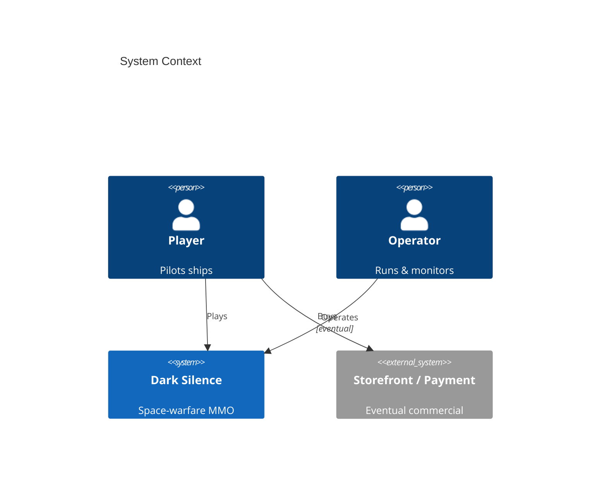
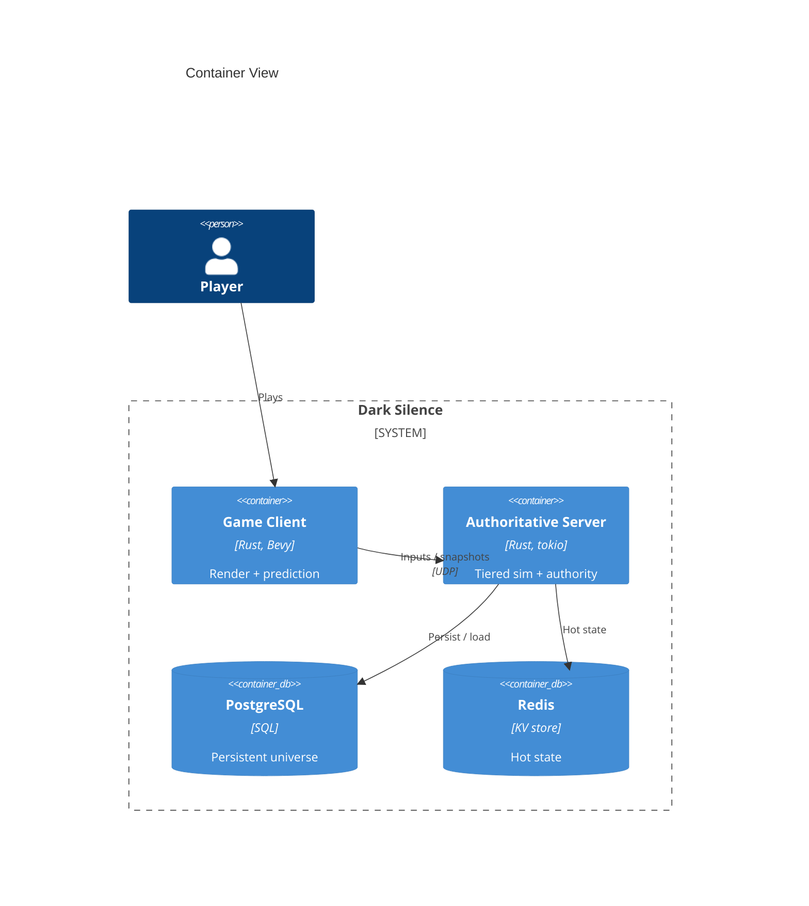
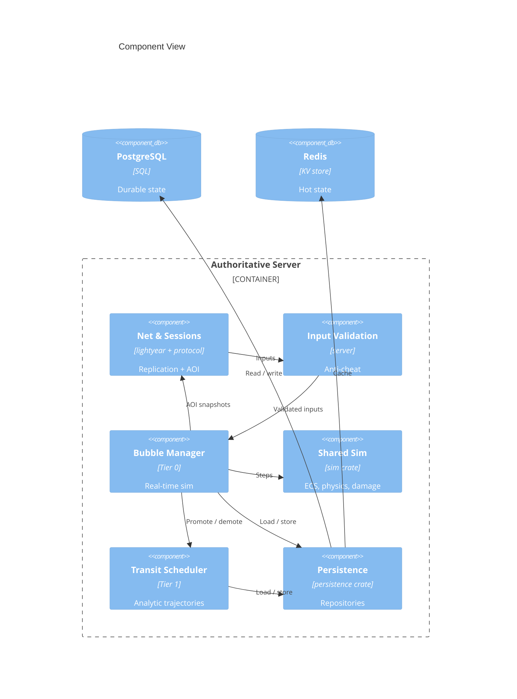
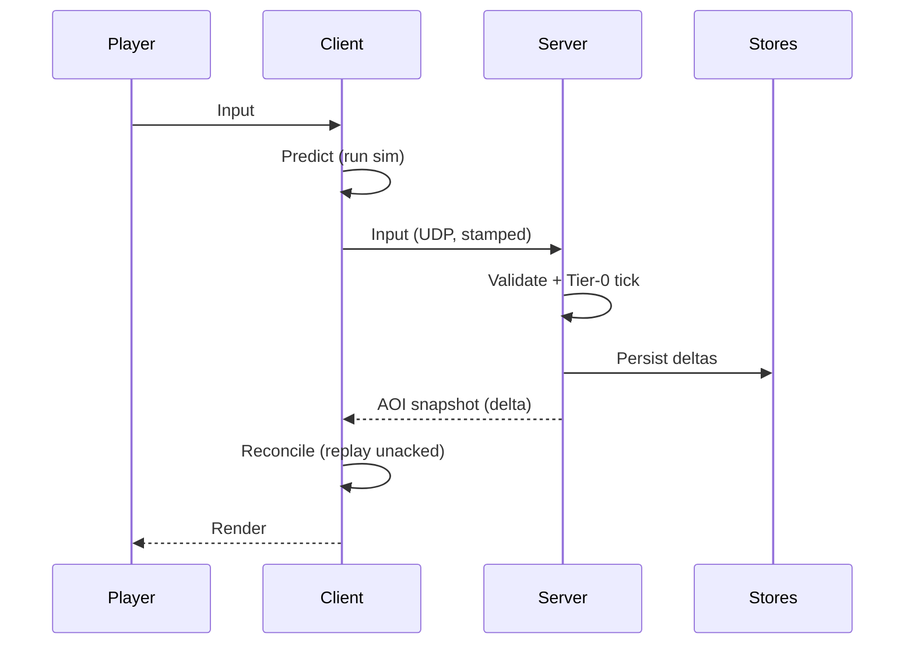
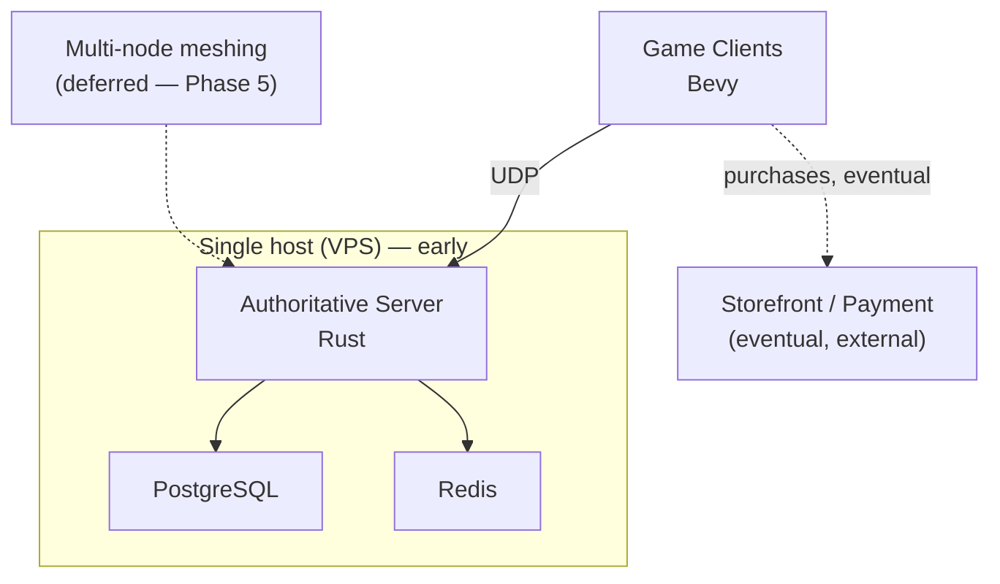

# Software Architecture Document: Dark Silence

> Date: 2026-06-01 | Status: Draft

## Purpose and Scope

Dark Silence is a top-down, physics-based space-warfare MMO: a single seamless, persistent universe where players pilot individually-fitted ships with Newtonian movement and hit-location damage, sustain a faction war through a player-driven economy, and survive on scarce information. This document defines the project-level technical baseline — the simulation model, network model, technology stack, data model, scaling strategy, and cross-cutting concerns — that all feature work must conform to. The defining architectural problem is delivering a *seamless, persistent, physics-based shared world affordably on a single node for a solo developer*, while keeping massive seamless scale reachable later.

## Technical Context

**Language/Version**: Rust (edition 2021; dev toolchain 1.92; MSRV: NEEDS CLARIFICATION)  
**Primary Dependencies**: Bevy (client) + `bevy_ecs` (shared sim); lightyear (networking); Rapier2D behind a `Physics` trait; `glam`; `bitcode` (snapshots); `sqlx`, `redis`, `tokio`, `tracing` (server) 
**Storage**: PostgreSQL (persistent universe + long-range/in-transit trajectories); Redis (hot/ephemeral: presence, sector occupancy, transit cache)  
**Testing**: `cargo test` unit/property tests (simulation & transit invariants, integrator↔analytic equivalence); headless-bot integration harness; `clippy -D warnings` + `rustfmt` 
**Target Platform**: Desktop client (Windows/Linux/macOS via Bevy); Linux server — single host early, containerized later  
**Project Type**: Online game — Bevy client + custom authoritative server in a multi-crate Cargo workspace 
**Performance Goals**: 30 Hz authoritative sim tick (runtime-variable for time dilation); 15–20 Hz snapshot send; client interpolation ~100 ms; replication bounded by a per-client bandwidth budget. Bandwidth/AOI is the binding constraint, not physics CPU.  
**Constraints**: single-node-first at modest scale; server-authoritative; **never pay-to-win**; solo-maintainable operational footprint; 13+ audience  
**Scale/Scope**: a modest concurrent community first (dozens → low-hundreds co-located); single-node large-scale battle as a stretch goal; multi-node seamless meshing explicitly deferred

## System Scope and Context

Players run a desktop client that connects to an always-on authoritative server holding the single source of truth for the world. The system is largely self-contained: NPCs, economy, and the war are internal. The only meaningful external integration is an eventual storefront/payment provider for the planned commercial model; an operator runs and monitors the live world.

### C4 System Context

### C4 Container View

### C4 Component View

The authoritative server's internal structure clarifies how the tiers, networking, and persistence interact, so it is included.

## Solution Strategy and Architecture Style

- **Architecture Style**: Tiered, server-authoritative client–server simulation, delivered as a modular Cargo workspace (monorepo of crates), running single-node with seamless-ready seams.
- **Source Code Location**: A Cargo workspace; designated source roots are each crate's `src/` directory under `crates/<name>/` (per `project-instructions.md` — a justified, idiomatic-Rust deviation from a single top-level `/src`). Shared gameplay logic lives in `crates/sim`.
- **Why this style fits**: Cost scales with player attention (tiers), client and server stay in sync (shared sim), the game ships and stays playable early (single-node), and large seamless scale remains reachable later (the seams) — all within one developer's capacity.
- **Alternatives considered**: flat real-time simulation of the whole world (prohibitively expensive); discrete zoned instances (breaks seamlessness); full dynamic server meshing from day one (studio-scale, blocks shipping — see ADR-0005); a general engine such as Unity/Unreal (the chosen path favors a Rust client+server sharing one sim crate — see ADR-0007).

## Key Runtime Flows and Failure Paths

### Primary Flow

A second signature flow — the long-range "message in a bottle" — exercises the tier seams: a projectile leaving all populated areas is **demoted** to a Tier-1 closed-form trajectory in PostgreSQL, then **promoted** back to a real-time Tier-0 body when its path approaches a sensor/populated bubble, re-seeded exactly from the analytic form (ADR-0001, ADR-0003).

### Failure Paths

- **Client packet loss / jitter** → redundant input sends + delta-vs-last-acked snapshots; remote-entity interpolation rides out gaps.
- **Server overload (megabattle)** → per-bubble **time dilation** (slow the tick rate, keep logical `dt`) instead of dropping players; current dilation is sent in the snapshot header so prediction stays correct.
- **Player disconnect** → ship coasts on momentum as a dormant Tier-1 entity for a grace period, then goes idle/AI; assets persist in the world.
- **PostgreSQL unavailable** → serve reads from the Redis hot layer, queue durable writes, and refuse risky state-mutating actions until storage recovers; back up before every migration.
- **Mismatched client (protocol/version)** → rejected at connect via a protocol version check.

## Deployment and Infrastructure View

Early operation is a single host (server process + PostgreSQL + Redis, possibly a managed DB). Containerization and, only on a measured trigger, multi-node meshing are later steps (ADR-0005).

## Cross-Cutting Concerns

### Security

The server is the single trust boundary: it is authoritative for all state and **validates every client input** (no teleporting, no impossible thrust, fire-rate limits) and never trusts client-reported positions or hits (lag-compensated server-side hit validation). Accounts use proper credential hashing or an auth provider. A competitive player economy requires anti-cheat and anti-RMT measures. **Information dominance is structurally anti-cheat:** clients receive only what their sensors/comms entitle them to (ADR-0006), so the classic maphack is impossible — the unseen data never reaches the client, and the only way to see more is to win the in-game information war. The in-fiction **cyberwarfare** system (ADR-0009) is a *simulated, sandboxed* model that never executes real exploits or touches real infrastructure/accounts. **Never pay-to-win** is a hard integrity constraint: no real-money path may feed in-game currency, gear, or the replacement/expedite mechanic. Account data follows GDPR/CCPA basics; a 13+ minimum avoids child-directed regulatory burden; secrets are managed out of source.

### Reliability

Early availability is bounded by a single host (accepted for the modest-scale phase). Resilience is primarily *graceful degradation*: time dilation under load rather than disconnects; momentum-coast on disconnect; durable persistence in PostgreSQL with a Redis hot layer; back-up-before-migrate. Availability targets are an open question to set with playtest data.

### Observability

Structured logging (`tracing`) and metrics (Prometheus) from the first networked phase. Key signals: per-bubble tick time, bytes/client/sec, time-dilation %, entity/AOI counts, reconciliation corrections. A replay recorder (captured input + snapshot streams) is the primary tool for diagnosing desync.

### Data Management

PostgreSQL is the durable source of truth (accounts, inventory, territory, economy, and Tier-1 trajectories); Redis holds ephemeral hot state (presence, sector occupancy, transit cache). Persisted entity formats are versioned; schema changes go through `sqlx` migrations with a backup first. The world uses an everything-persists-vulnerable model — assets are durable entities, lost only when their holding facility falls.

### Integration Strategy

The system is deliberately self-contained early (no external gameplay dependencies). Client↔server communication is UDP via lightyear, isolated behind the `protocol` crate + thin adapters so the networking library can be upgraded or swapped. Internal integration is through the shared `sim` and `protocol` crates. The only planned external integration is an eventual payment/storefront (merchant-of-record) for the commercial model.

### Operations

A single VPS plus a managed PostgreSQL to start; containerize later. Live-ops is lean (solo): metrics + alerting from early on, a moderation/reporting pipeline and ToS/privacy baseline before any public launch. Release proceeds in stages — closed alpha → time-boxed stress tests → early access — validating the core loop and economy at small scale.

## Quality Attributes

| Attribute | Target | Measurement | Notes |
|-----------|--------|-------------|-------|
| Performance | 30 Hz sim tick; ~100 ms interpolation; per-client bandwidth budget held | tick-time + bytes/client/sec metrics | Bandwidth/AOI is the wall, not CPU |
| Reliability | Degrade (time dilation), don't drop; modest availability early | uptime, disconnect & desync rates | Single-node early; accepted |
| Security | Server-authoritative; all inputs validated; never-P2W | input-rejection rate; anti-cheat/RMT signals | One trust boundary at the server |
| Maintainability | Shared sim; clean crate boundaries; tailor-made not framework | clippy clean; tests green | Reuse extracted on the rule-of-three |
| Scalability | Modest co-located first; single-node large battle as stretch | co-located bots within budget | Scale via AOI + budget + dilation + tiering |

## Architecture Decision Records

Project-level architectural decisions are maintained as standalone MADR files under `specs/adrs/`. This table is a navigational index — full decision records live in the linked files.

| ADR ID | Title | Status | Date | Supersedes | File |
|--------|-------|--------|------|------------|------|
| ADR-0001 | Tiered simulation architecture (real-time / transit / persistent) | accepted | 2026-06-01 | — | [0001-tiered-simulation-architecture.md](adrs/0001-tiered-simulation-architecture.md) |
| ADR-0002 | Server-authoritative netcode with client prediction and reconciliation | accepted | 2026-06-01 | — | [0002-server-authoritative-netcode.md](adrs/0002-server-authoritative-netcode.md) |
| ADR-0003 | Shared `sim` crate with fixed-timestep velocity-Verlet integration | accepted | 2026-06-01 | — | [0003-shared-sim-crate-and-fixed-step-integration.md](adrs/0003-shared-sim-crate-and-fixed-step-integration.md) |
| ADR-0004 | 2D authoritative physics (Rapier2D) behind a swappable `Physics` trait | accepted | 2026-06-01 | — | [0004-2d-physics-behind-trait.md](adrs/0004-2d-physics-behind-trait.md) |
| ADR-0005 | Single-node first; build the seams, defer multi-node meshing | accepted | 2026-06-01 | — | [0005-single-node-first-build-the-seams.md](adrs/0005-single-node-first-build-the-seams.md) |
| ADR-0006 | Interest management and bandwidth-first scaling | accepted | 2026-06-01 | — | [0006-interest-management-and-bandwidth-scaling.md](adrs/0006-interest-management-and-bandwidth-scaling.md) |
| ADR-0007 | Technology stack and Cargo workspace | accepted | 2026-06-01 | — | [0007-technology-stack-and-workspace.md](adrs/0007-technology-stack-and-workspace.md) |
| ADR-0008 | Unified domain data model — damage pipeline, modules/fitting, destructible hulls | accepted | 2026-06-01 | — | [0008-unified-domain-data-model.md](adrs/0008-unified-domain-data-model.md) |
| ADR-0009 | Cyberwarfare — simulated, sandboxed hacking & counter-hacking | accepted | 2026-06-01 | — | [0009-cyberwarfare.md](adrs/0009-cyberwarfare.md) |
| ADR-0010 | Shared property pipeline — empirical research → generative manufacturing → emergent tech | accepted | 2026-06-01 | — | [0010-research-manufacturing-property-pipeline.md](adrs/0010-research-manufacturing-property-pipeline.md) |
| ADR-0011 | Automation floor, human ceiling (how ship roles are operated) | accepted | 2026-06-01 | — | [0011-automation-floor-human-ceiling.md](adrs/0011-automation-floor-human-ceiling.md) |
| ADR-0012 | Physically grounded, gameplay-scaled modeling | accepted | 2026-06-01 | — | [0012-physically-grounded-gameplay-scaled.md](adrs/0012-physically-grounded-gameplay-scaled.md) |
| ADR-0013 | Thin Bevy client over the shared `sim`: fixed-step simulation with interpolated rendering | accepted | 2026-06-01 | — | [0013-thin-client-fixed-step-interpolated-rendering.md](adrs/0013-thin-client-fixed-step-interpolated-rendering.md) |
| ADR-0014 | Netcode backend — transport-level (renet) with game-owned prediction and replication | accepted | 2026-06-02 | — | [0014-netcode-transport-renet-own-netcode.md](adrs/0014-netcode-transport-renet-own-netcode.md) |

<!-- Rows are managed by the ADR Author subagent. Do not embed full decision prose here. -->

## Risks, Assumptions, Constraints, and Open Questions

### Risks

- **lightyear maturity** — a young, fast-moving core dependency. Mitigation: pin a version, isolate behind `protocol` + adapters, keep `bevy_replicon` as a fallback (ADR-0007).
- **Bandwidth/AOI scaling** — the true scaling wall; naive replication is O(n²). Mitigation: AOI + quantization + delta + per-client budget + priority from early on (ADR-0006).
- **Desync debugging** — prediction mismatches are timing-dependent and hard to reproduce. Mitigation: one shared sim code path + a replay recorder built early (ADR-0003).
- **Single-node availability ceiling** — one host is a single point of failure early. Mitigation: accept for modest scale; the seams keep multi-node reachable (ADR-0005).
- **Scope / solo sustainability** — building MMO infrastructure solo. Mitigation: single-node-first, deliver-value-early, deferred meshing.

### Assumptions

- Gameplay is planar (2D physics suffices though visuals are 3D).
- Newtonian motion extrapolates well, so reconciliation corrections are small.
- A single (vertically-scaled) node carries the early/modest-scale target.
- The NPC-populated world makes the universe feel alive at low concurrency.

### Constraints

- Rust + Bevy + custom authoritative server; Cargo workspace layout (per `project-instructions.md`).
- Single-node-first; server-authoritative; never pay-to-win; 13+ audience; solo-maintainable operations.
- Physically grounded, gameplay-scaled — real physics relationships, magnitudes scaled for playability (ADR-0012).
- Automation floor required so solo/under-crewed play is viable (ADR-0011); cyberwarfare is a simulated/sandboxed model only, never real exploits/infrastructure (ADR-0009).

### Open Questions

- Pin the MSRV.
- Concrete reliability/availability targets and backup cadence (calibrate with playtest data).
- The measured trigger thresholds for moving to multi-node (tick-budget / time-dilation floor).
- The multi-node meshing design itself (deferred; not yet designed).
- Hosting provider/region choice for early operation.
- Cyberwarfare depth & phasing — abstract baseline vs. deep simulated-systems (ADR-0009).
- Emergent-tech balance — keeping generative research/manufacturing fun and bounded, not OP or noisy (ADR-0010).
- Automation floor ↔ human-ceiling gap tuning per role (ADR-0011).
- Physics scale factors — the chosen compression of distance/speed/lethality/time (ADR-0012).

## Project Context Baseline Updates

- **2026-06-01 (refine):** Added ADR-0009 (cyberwarfare — sandboxed), ADR-0010 (research↔manufacturing shared property pipeline / emergent tech), ADR-0011 (automation floor / human ceiling), and ADR-0012 (physically-grounded, gameplay-scaled) to track the refined PRD (CAP-014 + new principles). Catalog, Security (info-dominance anti-cheat), Constraints, and Open Questions updated; ADR-0001…0008 unchanged.
- **2026-06-01 (plan E001):** QC tooling baseline for the Rust workspace, reusable across all crates — `cargo test` (unit/property), `cargo clippy -- -D warnings`, `cargo fmt --check`, `cargo-audit` (security / dependency-vulnerability scan), `cargo-llvm-cov` (coverage, non-gated). `bevy_ecs` is consumed with `default-features = false` in `sim` (pure ECS, no render/window).
- **2026-06-01 (plan E002):** Added ADR-0013 (thin Bevy client over the shared `sim`: fixed-step simulation with interpolated rendering). Client-architecture baseline, reusable for every client epic: the Bevy client is render/input/HUD only; gameplay logic lives in `sim` as headless `bevy_ecs` systems; the client advances `sim` in Bevy `FixedUpdate` (`Time<Fixed>`) decoupled from rendering and interpolates `Transform`s via `overstep_fraction()`; physics stays behind the `sim::Physics` trait (no `bevy_rapier2d`), which now grows collision/contact + swept-cast queries with glam/sim-only signatures. `bevy` 0.18 (client) is pinned to match `bevy_ecs` 0.18.
- **2026-06-02 (plan E003):** Added ADR-0014 (netcode backend — transport-level **renet** + game-owned prediction/replication; **refines ADR-0007**'s networking pick, lightyear evaluated-and-not-adopted; bevy_replicon/aeronet are documented fallbacks behind the same adapter). New project surfaces from E003: a **`protocol` crate** (library-agnostic wire messages — `ClientInput` / `Snapshot` / handshake — plus a `NetTransport` adapter trait + an in-memory loopback; renet confined to the `renet_adapter` module, never leaked) and a **headless `server` crate**; both consume the shared `sim` and run it deterministically on each end. The `protocol` snapshot stream is the stable surface E009 (interest-management/AOI) will filter/prioritize. Server runtime = a synchronous fixed-tick `bevy_ecs` loop polling renet (no tokio until E004 persistence). Snapshots: delta-vs-last-acked, `bitcode`-quantized, 15–20 Hz; bytes/client/sec measured as the E009 baseline.
- **2026-06-02 (specify E007):** The unified **damage/destruction vocabulary** (realizes ADR-0008, reads the E006 fit layout as the hitbox/armor map), shared by the economy (E013 consumes salvage): a typed **`DamageEvent`** (channel ∈ {kinetic, thermal/energy, blast, EM, radiation}, magnitude, penetration, impact geometry) flows through **ordered defense layers Shields → Armor → Hull → Systems** (each mitigating per a data-driven **(layer × channel) resistance matrix**; the outer Avoidance/PD/ECM layer is E010's, the Crew layer a later epic). **Angle-based hit-location penetration** (effective armor = thickness/cos θ; ricochet/overmatch; pen vs over-pen tiers) routes post-pen damage to the module behind the entry point (E006 `resolve_hit`). **Emergent damage**: a module's health scales its `ShipStats` contribution (damaged thruster → less thrust), so a battered ship degrades — extends `derive_ship_stats`, not a fork. **Coarse module/section destruction** (cell-grid-ready) + **connectivity severing** (flood-fill ONLY on destruction → disconnected regions become drifting **wreck chunks** with inherited momentum) + **clean-sever salvage** (intact module vs through-kill scrap; persistent lootable wrecks → E013). All damage resolves **server-authoritatively** reusing the swept-ray CCD; lethality is grounded-but-gameplay-scaled (ADR-0012). Replaces whole-ship-HP combat (BREAKING). Deferred: DoT/cascades, new weapon delivery (missiles/torpedoes), fine per-cell destruction, AOI-scaled replication (E009).
- **2026-06-02 (specify E006):** The unified **fitting/domain vocabulary** (realizes ADR-0008), shared by combat (E007), economy (E013), and manufacturing (E014): every installed device is a data-driven **Module** (uniform stat block — power gen/draw, CPU/control, mass, heat, hitbox/health, hardpoint type/size); a ship = **Hull** (authored as a 2D cell-grid) + positionally-placed **Hardpoints/Slots** + a **Fit**. The realized fit layout **is** the **hitbox/armor map** — outer modules shield inner, weapon hardpoints carry position-derived **firing arcs** — the positional surface E007's damage model reads directly. Fitting is bounded by three competing budgets (**power / CPU / mass**); the fit's **effective stats** drive flight + weapons, replacing E002's global `Tuning` stand-in (fitting changes how the ship flies). Hull geometry stays designer-authored (players fit modules, not build geometry). The fitting UI lives in the `client` crate; the domain model in `sim`.
